# CMP: 20 nm-Class BCAT DRAM Reliability Design

### MEB–Cov–GIDL Correlation and High-Temperature Retention/Refresh-Aware Process Window

> **Project status:** Run 0 completed<br>
> **Tool:** Synopsys Sentaurus TCAD T-2022.03<br>
> **Current model:** Simplified 2D BCAT reference structure<br>
> **Current verified scope:** Geometry, contacts, doping, mesh, MEB parameterization, and basic NMOS turn-on

---

## 1. Program Overview (프로그램 개요)

CMP(Chips Master Program)는 첨단분야 혁신융합대학사업단과 숭실대학교 차세대반도체학과가 운영하는 실무 중심 장기 프로젝트 프로그램입니다.

- **활동 기간:** 2026.04–2027.01
- **핵심 목표:** AI 반도체 및 메모리의 기술적 병목을 분석하고, TCAD 기반 소자·공정 설계를 통해 물리적으로 설명 가능한 개선 방향을 제안
- **주요 활동:** 이론 학습, 산업 요구 분석, 기업 탐방, TCAD 구조·물리모델 구축, 공정 변수 DOE 및 결과 해석

---

## 2. Topic Evolution (주제 변경 흐름)

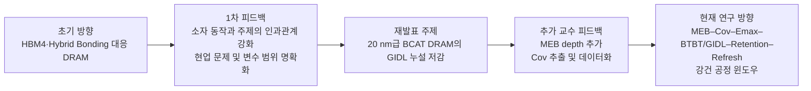

### 2.1 재발표 주제

**20 nm급 BCAT DRAM에서의 GIDL 누설 전류 저감 최적화 설계**

재발표 단계에서는 미세화에 따른 trench corner 전계 집중과 BTBT 기반 GIDL을 주요 문제로 설정하고, 구조 및 도핑 변수를 조절하여 누설을 줄이는 방향을 제시했습니다.

- **[주제 재발표 자료(PDF)](CMP_소자공정_송민호(재발표).pdf)**

### 2.2 교수 피드백 반영

재발표 합격 후 다음 두 항목이 핵심 과제로 추가되었습니다.

1. GIDL의 주요 구조 변수로 **MEB(Metal Etch-Back) depth**를 추가
2. Gate–Si/drain 간 전기적 결합을 나타내는 **Cov(overlap capacitance)**를 핵심 측정 파라미터로 설정

이에 따라 프로젝트의 중심을 단순한 “최소 GIDL 구조 선택”에서 다음과 같이 고도화했습니다.

> **MEB 공정 편차가 Cov와 drain-side 전계를 통해 BTBT/GIDL, 저장전하 유지, refresh 부담에 미치는 경로를 규명하고, 온도 및 공정 편차에도 안정적인 공정 윈도우를 제안한다.**

### 2.3 Current Research Title (현재 권장 주제명)

**AI 메모리용 DRAM의 고온 Refresh 부담 저감을 위한 20 nm급 BCAT의 MEB–Cov–GIDL 강건 설계**

본 연구는 특정 기업의 HBM4 또는 LPDDR6 셀을 직접 재현하는 것이 아니라, AI 메모리에서 중요해지는 저전력·고온 신뢰성 요구를 공개 문헌 기반 BCAT reference model에서 분석하는 기초 설계 연구입니다.

---

## 3. Key Concepts (핵심 개념)

| 개념 | 간단 정의 | 본 프로젝트에서의 역할 |
|---|---|---|
| **DRAM 1T1C** | Access transistor 1개와 storage capacitor 1개로 데이터를 저장하는 셀 | Cell transistor 누설이 저장전하 유지와 refresh 요구량에 영향을 줌 |
| **BCAT** | Gate/word line을 silicon trench 내부에 매립한 DRAM cell transistor | 유효 채널 길이와 gate control을 확보하지만 trench corner 전계 집중 가능 |
| **GIDL** | OFF 상태에서 낮은 gate 전압과 높은 drain 전압에 의해 발생하는 drain-side 누설 | Drain-side 고전계 및 BTBT에 의해 증가하는 핵심 분석 대상 |
| **BTBT** | 강한 전계에서 valence band의 전자가 conduction band로 터널링하는 현상 | GIDL 발생 메커니즘을 설명하는 물리모델 |
| **MEB** | Trench 내부 metal gate를 일정 깊이까지 etch-back하는 공정 | Gate top 위치, overlap, Cov, 전계 및 gate control을 변화시키는 핵심 변수 |
| **Cov** | Gate와 인접 Si/drain 사이의 overlap·fringing 기반 기생 capacitance | MEB 형상과 drain-side coupling을 연결하는 전기적 지표. 후속 단계에서 off-state `Cgd` 기반 유효 Cov를 정의할 예정 |
| **Emax** | Drain-side gate/oxide/Si 인접 영역의 국부 최대 전계 | BTBT/GIDL 증가 원인을 정량적으로 설명하는 지표 |
| **Retention** | Refresh 없이 저장 데이터가 판독 가능한 상태로 유지되는 시간 | 누설 감소 효과를 DRAM 동작 지표로 변환 |
| **Refresh burden** | Retention 변화에 따라 요구되는 상대적 refresh 빈도·부담 | 실제 절대 전력 대신 normalized metric으로 평가 예정 |
| **Robust process window** | 온도와 공정 편차가 있어도 GIDL·Ion·Vth·SS·retention 조건을 함께 만족하는 범위 | 최종 산출물 |

---

## 4. Research Hypothesis (물리적 가설)

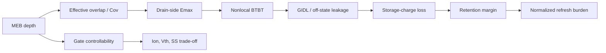

- MEB depth가 변하면 gate top 위치와 drain-side capacitive coupling이 변합니다.
- Cov와 Emax의 변화는 BTBT 기반 GIDL에 영향을 줄 수 있습니다.
- 최소 GIDL 구조가 반드시 고온·공정 편차 조건에서 최적의 retention과 구동 성능을 동시에 제공하는 것은 아닐 수 있습니다.
- 최종 목표는 단일 최솟값이 아니라 **MEB–Cov 기반 robust process window**입니다.

---

## 5. TCAD Virtual Run Sheet

| Run | 단계 | 핵심 작업 | 상태 |
|---:|---|---|---|
| **0** | Baseline structure generation | 2D BCAT 구조, contact, doping, local mesh, MEB parameterization, basic Id–Vg sanity check | **Completed** |
| **1** | Baseline electrical stabilization | 저전류 수치 안정화, Vth·SS·Ion·Ioff 추출 | Next |
| **2** | Output and mesh verification | Id–Vd, potential/eDensity, mesh convergence | Planned |
| **3** | GIDL condition setup | OFF/negative gate bias, high drain bias, Local → Nonlocal BTBT | Planned |
| **4** | MEB 3-level screening | 초기 MEB split에서 Cov·Emax·GIDL 경향 확인 | Planned |
| **5** | MEB 5-level DOE | 공정 편차 수준 확대 및 Cov–GIDL 상관성 분석 | Planned |
| **6** | Temperature split | 300/340/380 K 고온 특성 비교 | Planned |
| **7** | Retention proxy | 총 유효 누설 기반 1차 retention estimate | Planned |
| **8** | MixedMode 1T1C retention | Write–Hold–Read transient와 storage-node decay | Planned |
| **9** | Refresh translation | Normalized refresh burden 계산 | Planned |
| **10** | Robust process window | 성능·누설·retention을 함께 만족하는 MEB 범위 제안 | Planned |

---

## 6. Run 0 — Baseline Structure Generation

### 6.1 Goal

Run 0의 목표는 후속 GIDL 및 retention 분석 전에 재현 가능한 simplified 2D BCAT baseline을 구축하고, 다음 항목을 검증하는 것입니다.

- Geometry와 material regions
- Source/drain/gate/substrate contacts
- P-body와 N+ source/drain doping
- Gate/trench 주변 local mesh
- SWB 기반 MEB depth parameterization
- SDE → SDevice 연결
- 기본 NMOS Id–Vg turn-on 및 on-state electron channel

### 6.2 Baseline Parameters

| Parameter | Run 0 value | 비고 |
|---|---:|---|
| Coordinate | X: depth, Y: lateral | 일반적인 단면 표시를 위해 축 회전 |
| Gate width | 20 nm | Metal-gate lateral width |
| Recess depth | 120 nm | Trench depth |
| Gate oxide | 5 nm | SiO₂ liner |
| Nominal MEB depth | 36 nm | Silicon surface에서 metal-gate top까지 |
| MEB dry-run split | 31 / 36 / 41 nm | 구조 파라미터 동작 검증 |
| Junction depth | 48 nm | `0.4 × recess depth` |
| S/D lateral setback | 15 nm | Simplified 2D assumption |
| Body doping | Boron `1×10^17 cm^-3` | Uniform P-type body |
| S/D doping | Arsenic `1×10^20 cm^-3` | Abrupt N+ regions |
| Gate work function | 4.8 eV | SDevice electrode setting |
| Local minimum mesh | 0.5 nm | Gate/trench refinement window |
| Temperature | 300 K | Electrical sanity check |
| Drain bias | 0.05 V | Linear-region Id–Vg |
| Gate sweep | 0–1.5 V | Basic NMOS turn-on |

### 6.3 MEB Parameterization

<p align="center">
  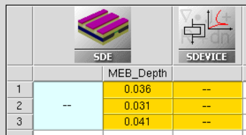
</p>

| Split | MEB depth | SDE node | SDevice node |
|---|---:|---:|---:|
| Low | 31 nm | n6 | n7 |
| Nominal | 36 nm | n2 | n5 |
| High | 41 nm | n8 | n9 |

세 구조에서 gate bottom과 trench depth는 고정하고, metal-gate top과 nitride cap 경계만 이동하도록 구현했습니다. 이 split은 최적화 결과가 아니라 parameterization dry run입니다.

<p align="center">
  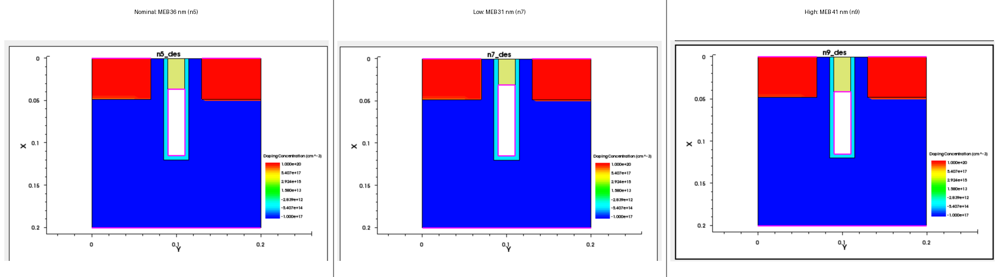
</p>

### 6.4 Material Regions, Contacts, and Doping

<p align="center">
  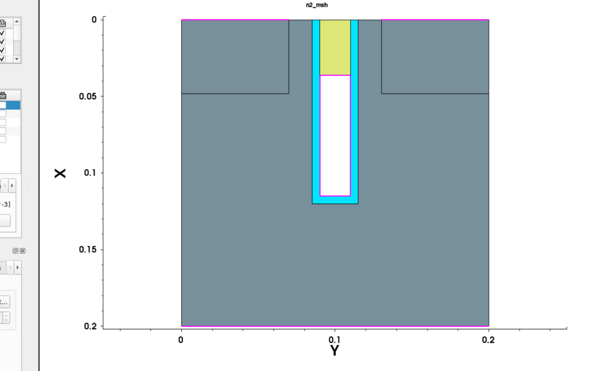
</p>

- Silicon body, source, drain
- SiO₂ trench liner
- Nitride cap
- Internal gate electrode boundary
- `source`, `drain`, `gate`, `substrate` contact 확인

현재 SDE 코드에서는 tungsten gate body를 제거하고 내부 경계를 gate electrode contact로 변환하므로, SVisual에서 중앙 gate 내부가 흰색으로 표시되는 것은 정상입니다.

<details>
<summary>Region/contact verification evidence</summary>

<p align="center">
  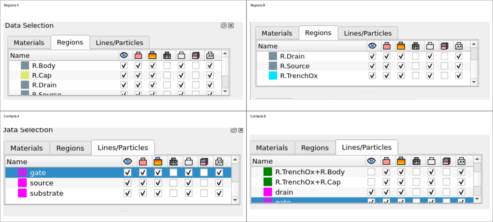
</p>

</details>

<p align="center">
  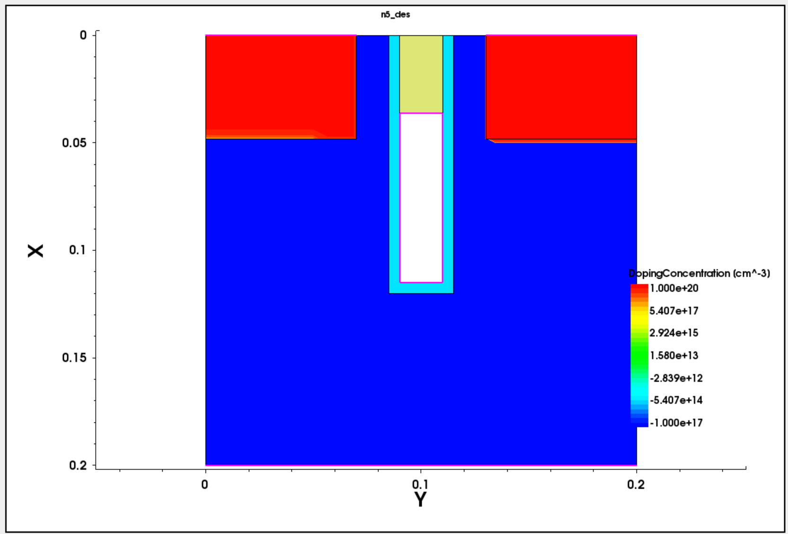
</p>

Nominal 구조는 `1×10^20 cm^-3`의 abrupt N+ source/drain과 `1×10^17 cm^-3`의 uniform P-body를 사용합니다.

### 6.5 Mesh Verification

<p align="center">
  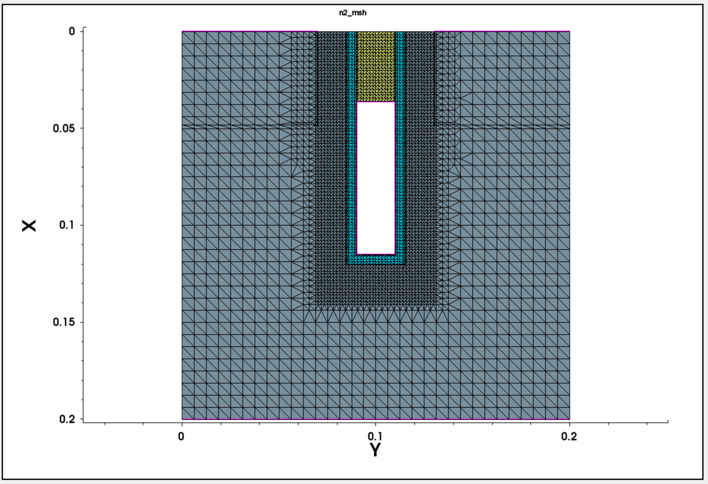
</p>

<p align="center">
  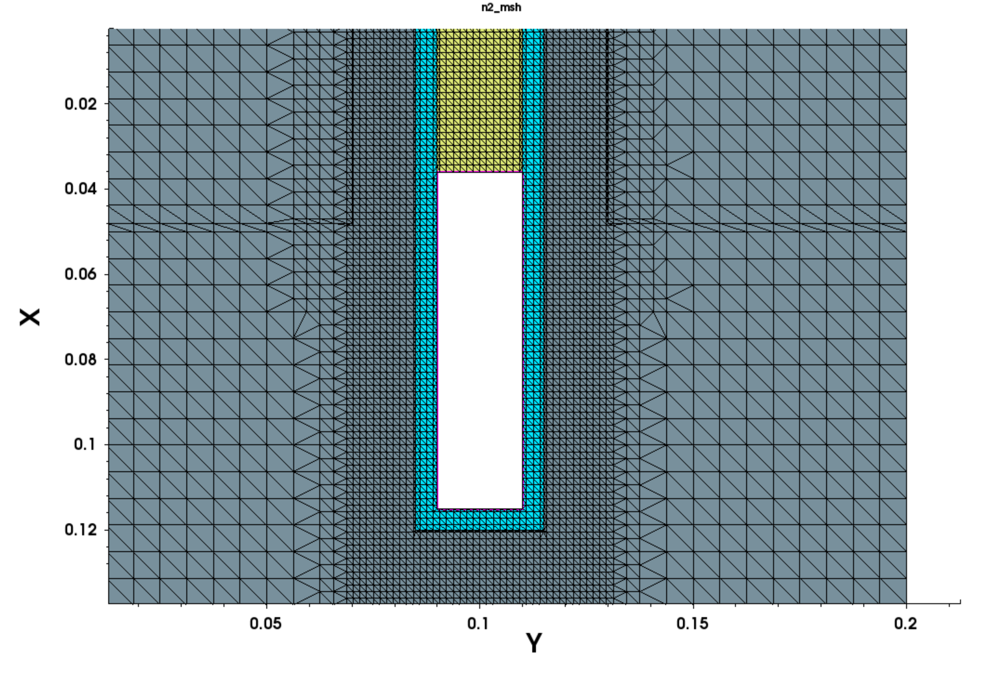
</p>

Global mesh와 별도로 gate/trench 및 junction 주변에 local refinement를 배치했습니다. Gate/oxide 주변 최소 설정값은 0.5 nm이며, Run 0에서는 mesh 생성과 배치만 확인했습니다. 정식 mesh convergence는 Run 2에서 수행합니다.

### 6.6 Electrical Sanity Check

Nominal MEB 36 nm 구조에서 다음 조건으로 SDevice를 실행했습니다.

- `T = 300 K`
- `VD = 0.05 V`
- `VG = 0–1.5 V`
- Fermi statistics
- Doping-dependent mobility, high-field saturation, Enormal
- SRH and Auger recombination
- **BTBT model not included**

<p align="center">
  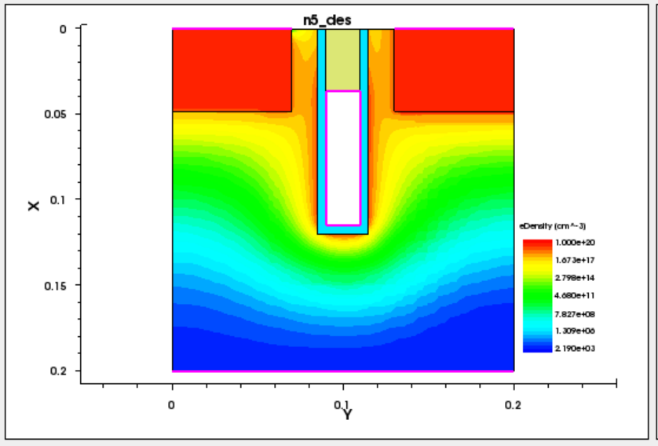
</p>

`VG = 1.5 V`에서 source–gate/trench–drain 방향으로 electron density가 연결되어 기본 channel 형성을 확인했습니다.

<p align="center">
  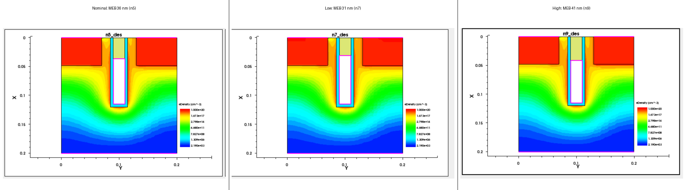
</p>

31/36/41 nm MEB split에서도 같은 on-state 조건의 electron-channel 형성을 확인했습니다. 이 비교는 구조 파라미터화와 전기적 연결을 점검한 결과이며, MEB 최적화 결과를 의미하지 않습니다.

<p align="center">
  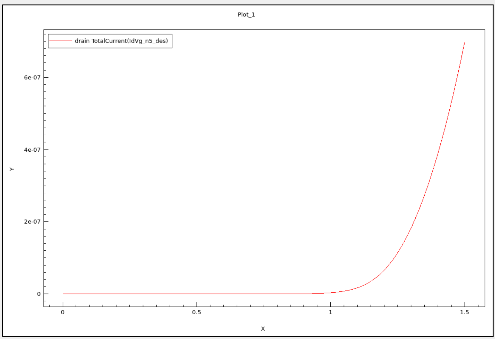
  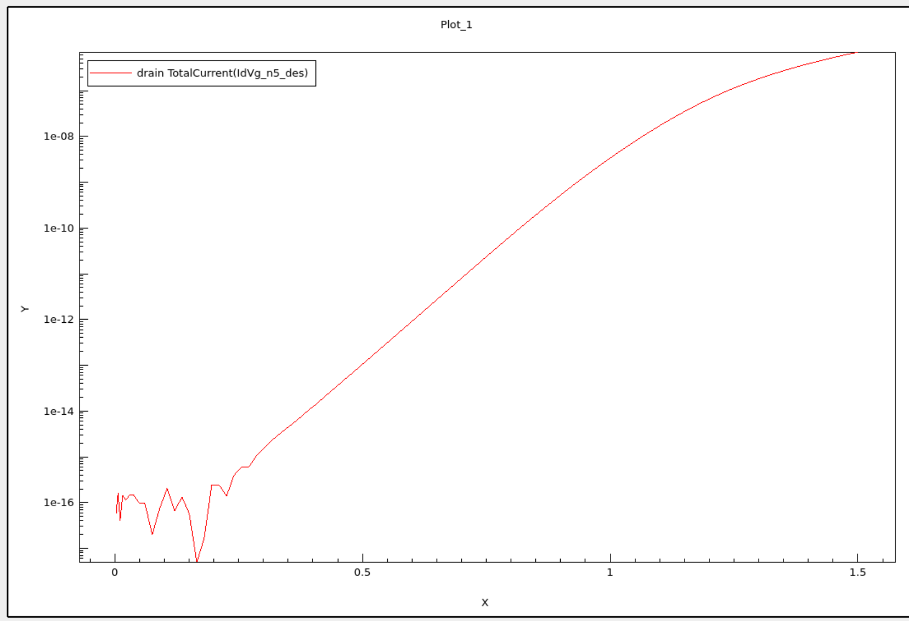
</p>

Linear 및 semilog Id–Vg에서 기본 NMOS turn-on을 확인했습니다. 극저전류 영역의 수치 요동은 Run 1에서 안정화할 예정입니다.

> **Important:** Run 0에는 BTBT가 활성화되지 않았으므로 저 gate voltage 영역의 전류를 GIDL로 해석하지 않습니다.

### 6.7 Run 0 Result

**Run 0 — Technical completion achieved**

- Geometry and material regions: verified
- Four contacts: verified
- Doping polarity and concentration: verified
- MEB 31/36/41 nm geometry split: verified
- Global/local mesh generation: verified
- SDE → SDevice workflow: verified
- Basic Id–Vg turn-on: verified
- On-state electron-channel formation: verified

---

## 7. Model Scope and Limitations

- 본 모델은 공개 문헌 조건을 기반으로 구축한 **simplified 2D BCAT reference model**입니다.
- 특정 기업의 양산 DRAM 공정이나 HBM4/LPDDR6 실제 셀을 직접 재현하지 않습니다.
- Reference study의 full 3D saddle-fin geometry는 구현하지 않았습니다.
- Run 0 source/drain은 Gaussian profile이 아니라 abrupt constant profile입니다.
- MEB는 etch time, plasma power, gas flow가 보정된 공정 예측이 아니라 **metal-gate top 위치 변화로 나타낸 구조적 결과**입니다.
- BTBT, GIDL, Cov, retention 및 refresh는 Run 0에서 아직 계산하지 않았습니다.
- 2D raw drain current는 default width normalization에 따른 값이며, 상용 DRAM cell의 절대 전류로 해석하지 않습니다.
- 절대 GIDL 및 retention 수치보다 물리적 경향과 설계 가이드 도출을 우선합니다.

---

## 8. Repository Structure

```text
CMP/
├─ README.md
├─ CMP_소자공정_송민호(재발표).pdf
├─ code/
│  ├─ sde/
│  │  └─ bcat_baseline_sde_r0_v1.cmd
│  └─ sdevice/
│     └─ bcat_idvg_r0_verify.cmd
├─ assets/
│  └─ images/
│     └─ run00/
└─ docs/
   └─ progress/
      └─ 2026-07-28-run00-baseline.md
```

Generated Sentaurus files such as `.tdr`, `.plt`, `.log`, and temporary node outputs are not intended for repository tracking.

---

## 9. Next Step — Run 1

Run 1에서는 nominal baseline의 전기적 특성을 안정화하고 정식 성능 지표를 추출합니다.

- Semilog 저전류 구간 수치 안정화
- `abs(drain TotalCurrent)` 기준 정리
- Vth, SS, Ion, Ioff, Ion/Ioff 추출
- Gate sweep 조건 검토
- Potential 및 electron-density contour 확인

Run 1을 완료한 뒤 Id–Vd와 mesh convergence를 수행하고, 이후 GIDL bias 및 BTBT 모델 단계로 이동합니다.

---

## 10. References

1. M. Sun, H. W. Baac, and C. Shin, “Simulation Study: The Impact of Structural Variations on the Characteristics of a Buried-Channel-Array Transistor (BCAT) in DRAM,” *Micromachines*, 2022. DOI: [10.3390/mi13091476](https://doi.org/10.3390/mi13091476)
2. S. K. Jang and S. Y. Kim, “Impact of Metal and Poly Gate Thickness on GIDL in DRAM Dual Work-Function Structures,” *ICEIC*, 2026. DOI: [10.1109/ICEIC69189.2026.11386251](https://doi.org/10.1109/ICEIC69189.2026.11386251)

---

## License / Usage Note

This repository documents an academic TCAD study. Synopsys Sentaurus input decks are provided for educational and research documentation purposes; Synopsys software and proprietary model implementations are subject to their respective licenses.
