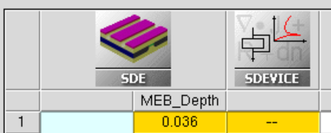
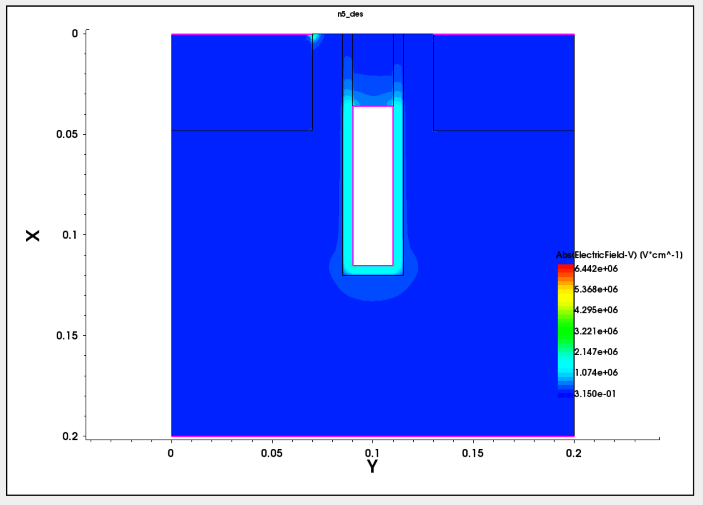
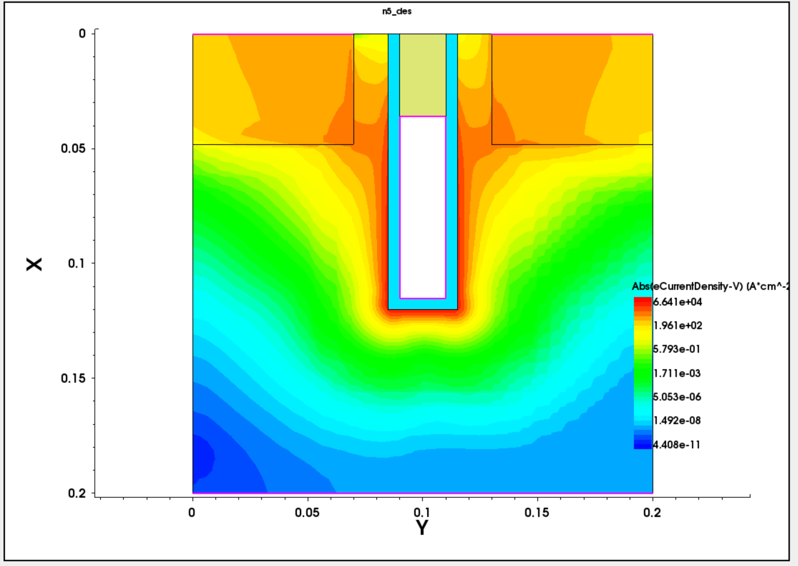
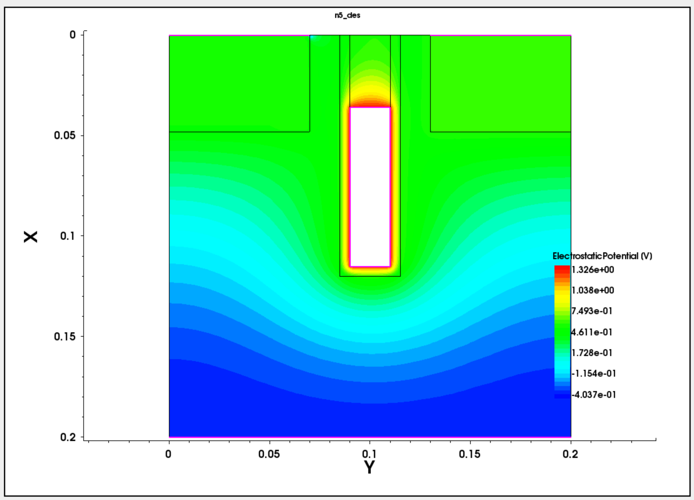

# Run 0 — 20 nm-Class Simplified 2D BCAT Baseline

## 1. Run Metadata

| Field | Value |
|---|---|
| Run | Run 0 |
| Model ID | B0 |
| Status | Completed |
| Execution date | 2026-07-28 |
| Close-out date | 2026-08-02 |
| Tools | Sentaurus Workbench, SDE, SDevice, SVisual T-2022.03 |
| Next stage | Run 1 — DC metric freeze |

## 2. Objective

Establish a reproducible nominal BCAT baseline before introducing formal metrics, mesh convergence, BTBT/GIDL, Cov, temperature, retention, refresh, or variation analysis. Run 0 verifies the structure, SDE–SDevice connection, reference mesh placement, basic NMOS turn-on, and ON-state spatial sanity contours.

## 3. Baseline Definition

| Parameter | B0 value | Note |
|---|---:|---|
| `Lgate` | 20 nm | Metal-gate lateral width |
| `Drecess` | 120 nm | Trench/recess depth |
| `Tox` | 5 nm | SiO₂ liner |
| Nominal MEB/gate-top depth | 36 nm | Fixed B0 definition |
| Junction depth | 48 nm | Geometrical boundary |
| S/D lateral setback | 15 nm | Simplified user-defined assumption |
| Body doping | B `1×10^17 cm^-3` | Uniform P-body |
| Source/drain doping | As `1×10^20 cm^-3` | Abrupt constant N+ regions |
| Gate work function | 4.8 eV | Single-WF electrode |
| Temperature | 300 K | Electrical sanity check |
| Drain bias | `VD=0.05 V` | Final drain voltage |
| Gate sweep | `VG=0→1.5 V` | Final gate voltage 1.5 V |
| BTBT | Off | No GIDL interpretation |

The B0 nominal MEB/gate-top depth is 36 nm and remains fixed as the Run 0 baseline.

## 4. Model Scope and Assumptions

- B0 is a **20 nm-class simplified 2D BCAT baseline**, not a complete 3D reproduction of Sun et al. (2022).
- The model uses a single-WF gate electrode at 4.8 eV.
- Actual etch process physics is not simulated.
- `MEB is represented geometrically by the metal-gate-top depth in the simplified SDE structure.`
- The source/drain implementation is an abrupt rectangular approximation; the lateral setback of 15 nm is a simplified user-defined assumption.
- There is no 3D saddle-fin width and no production-cell current calibration.
- Terminal current is raw simplified 2D current.
- Run 0 mesh images are reference evidence only; convergence belongs to Run 2.
- No BTBT, GIDL, Cov/Cgd, retention, refresh burden, robust process window, or Dual-WF superiority is established here.

See [Model Scope](../MODEL_SCOPE.md) for the controlled comparison principle.

## 5. Input Files

- [SDE structure deck](../../code/sde/run00/bcat_baseline_sde_r0_v1.cmd)
- [SDevice verification deck](../../code/sdevice/run00/bcat_idvg_r0_verify.cmd)
- [Raw signed source-current CSV](../../data/run00/raw/r00_b0_idvg_meb36nm_vd0p05_vg0to1p5_t300k_raw.csv)
- [Run 0 artifact manifest](../../data/run00/manifest.csv)

The full SDevice log is a local source-only artifact. It was used to verify the execution summary below and is not copied into or committed to the repository.

## 6. Structure Verification

Nominal B0 was checked for geometry, material regions, and source/drain/gate/substrate contacts. The SDE implementation removes the tungsten body after converting its boundary to the gate electrode contact; the displayed interior follows that modeling choice.

Verified items:

- Silicon body, source, and drain regions
- SiO₂ trench liner and nitride cap
- `source`, `drain`, `gate`, and `substrate` contacts
- Uniform P-body and abrupt N+ source/drain concentrations

## 7. Mesh Verification

Global refinement and local gate/trench/junction refinement windows were placed and a mesh was successfully generated. The local settings document Run 0 reference placement only; no coarse/medium/fine metric convergence claim is made.

## 8. Electrical Sanity Check

The nominal structure was run at 300 K with `VD=0.05 V` and `VG=0→1.5 V`. The deck includes Fermi statistics, OldSlotboom effective intrinsic density, doping-dependent mobility, high-field saturation, Enormal mobility degradation, SRH, and Auger. BTBT is intentionally off.

Direct checks from `source_only/run00_sdevice_full.log.txt`:

| Log check | Verified value |
|---|---|
| Final drain voltage | `5.000E-02 V` |
| Final gate voltage | `1.500E+00 V` |
| Final drain conduction current | approximately `6.977E-07 A` |
| Final source conduction current | approximately `-6.977E-07 A` |
| Fatal error | None found |
| MinStep termination | None found |
| Final plot write | `n5_des.tdr` write completed (`done`) |
| Peak memory | 198 MB |
| Wallclock | 57.68 s |
| Exit | Normal `Good Bye` |

These values are execution sanity evidence, not official Ion/Ioff, Vth, or SS metrics.

The plots support basic NMOS turn-on and spatial sanity only. Low-gate-voltage current must not be interpreted as GIDL because BTBT is disabled.

## 9. Parameterization Development Check

The 31/36/41 nm cases confirm that the SWB parameter and connected structure/device flow respond to `MEB_Depth`. They are not baseline performance cases.

> **Not a baseline DOE.** 
> **Not an optimization result.** 
> **Not used for performance claims.**

| Development split | MEB/gate-top depth | Purpose |
|---|---:|---|
| Low | 31 nm | Parameter response check only |
| Nominal | 36 nm | B0 reference |
| High | 41 nm | Parameter response check only |

## 10. Data Inventory

| Artifact | Policy |
|---|---|
| `data/run00/raw/r00_b0_idvg_meb36nm_vd0p05_vg0to1p5_t300k_raw.csv` | Git-tracked raw signed source-current export; unchanged values and columns |
| `data/run00/manifest.csv` | Git-tracked inventory of code, CSV, images, and local-only outputs |
| 15 PNG files in `assets/images/run00/` | Git-tracked Run 0 evidence |
| `.tdr`, `.plt`, full `.log`, `.out`, `.job` | Local-only; not committed |
| Processed metric CSV | Not created in Run 0 |

## 11. Pass/Fail Checklist

| Item | Result |
|---|---|
| Geometry and material regions | Pass |
| Four contacts | Pass |
| Doping polarity and concentrations | Pass |
| Local mesh placement and generation | Pass |
| SDE–SDevice linkage | Pass |
| 300 K basic Id–Vg turn-on | Pass |
| ON-state spatial sanity contours | Pass |

| Not completed in Run 0 | Status |
|---|---|
| Official Vth/SS/Ion/Ioff/DIBL | Run 1 |
| Mesh convergence | Run 2 |
| GIDL/BTBT | Run 3+ |
| Cov | Run 5A+ |
| Retention | Run 7–8, conditional |
| Refresh burden | Run 9, conditional |
| Robust process window | Not established; Run 10 targets a variation-aware design window |

## 12. Verified Claims

- Nominal B0 geometry and specified material regions are present.
- Four named contacts are connected through the SDE–SDevice flow.
- Uniform P-body and abrupt N+ source/drain doping are present at the documented nominal concentrations.
- Local mesh placements exist and the reference mesh was generated.
- At 300 K, `VD=0.05 V`, `VG=0→1.5 V`, the nominal deck completed and showed basic NMOS turn-on.
- ON-state eDensity, eCurrentDensity, ElectricField, and Potential contours passed spatial sanity inspection.
- The 31/36/41 nm split responds as a parameterization development check.

## 13. Claims Not Yet Supported

- BTBT or GIDL magnitude, trend, or improvement
- Cov/Cgd value or correlation
- Official Vth, SS, Ion, Ioff, Ion/Ioff, or DIBL
- Retention or refresh-burden improvement
- Robust process window
- Dual-WF superiority
- Calibrated production-cell current
- Performance ranking or optimization across 31/36/41 nm

## 14. Known Risks and Follow-up

- Low-current numerical behavior and extraction definitions must be frozen in Run 1 before metrics are produced.
- Reference mesh placement is not convergence; Run 2 must compare coarse/medium/fine regional meshes and peak locations.
- BTBT/GIDL feasibility depends on bias, physics-model selection, and mesh-stable generation location.
- Cov may require AC extraction or a Q–V derivative fallback; neither is assumed to work yet.
- Direct retention depends on BL/SN mapping, capacitor, and write/hold/read criteria. Any fallback must be labeled as a proxy.
- Rectangular trench-bottom corner sensitivity is conditional on later off-state ElectricField/BTBT hotspot evidence.

## 15. Exit Decision

> Run 0 — 20 nm-class simplified 2D BCAT nominal baseline implementation and electrical sanity check: Completed.

Exit is limited to the verified scope above. Run 1 — DC metric freeze is the current next step, and no Run 0 raw values are promoted to official metrics before its definitions are fixed.
