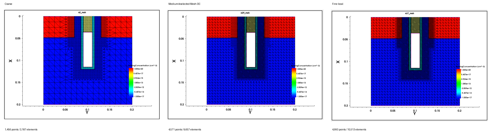
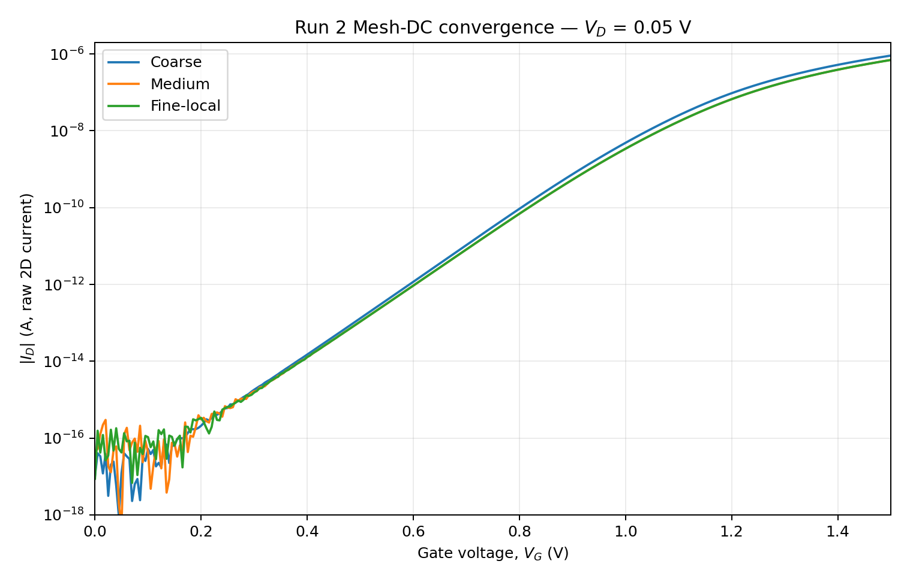
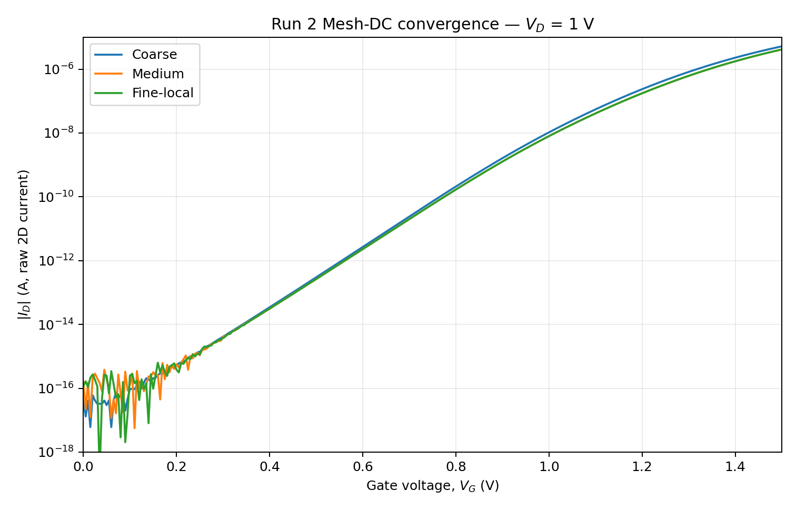
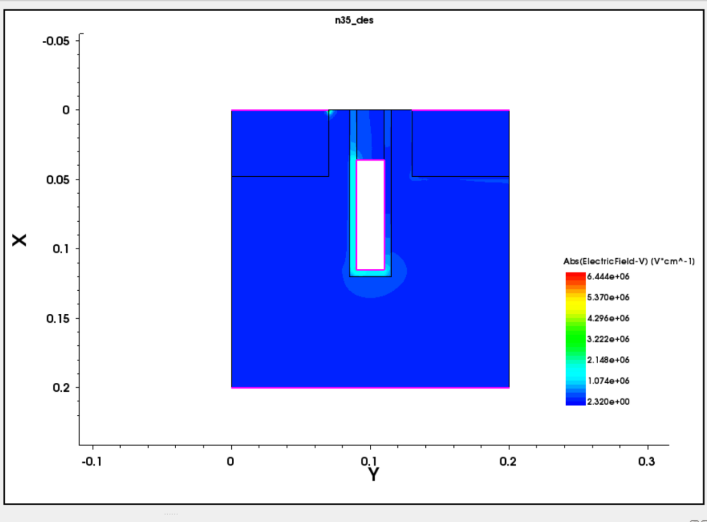
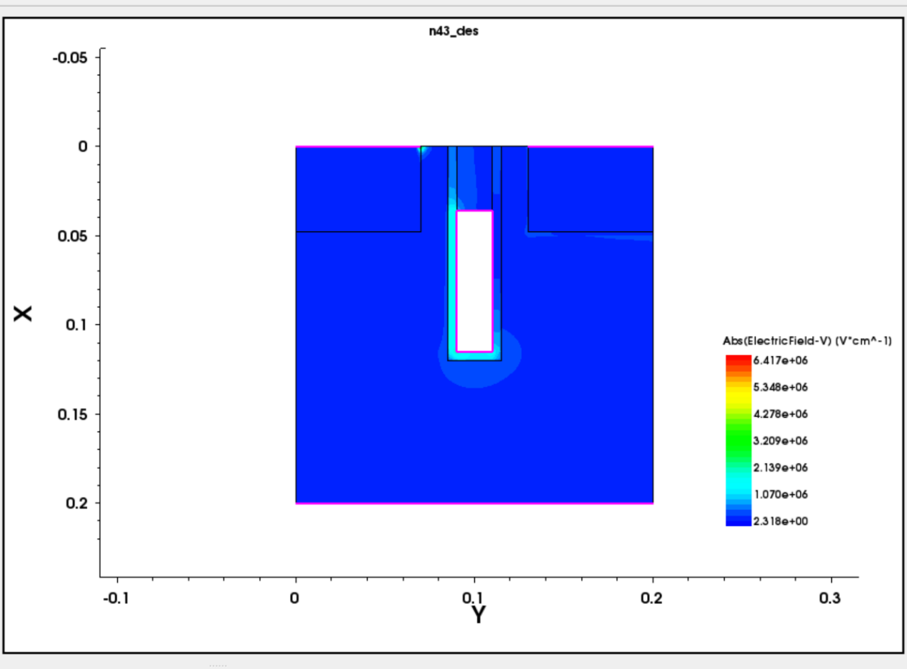
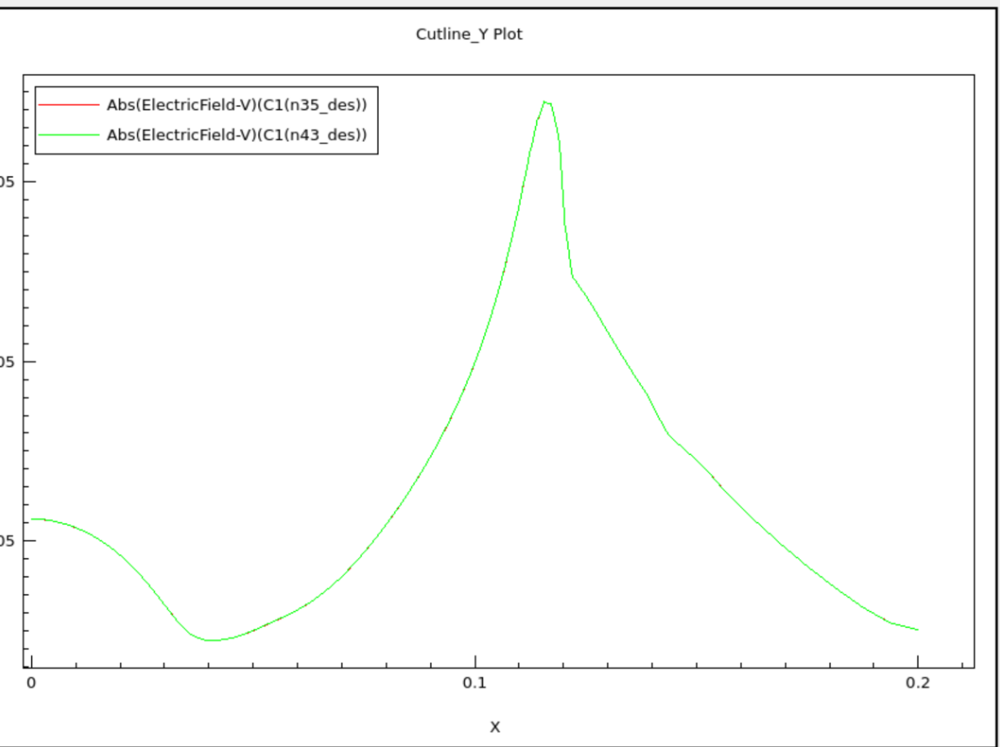
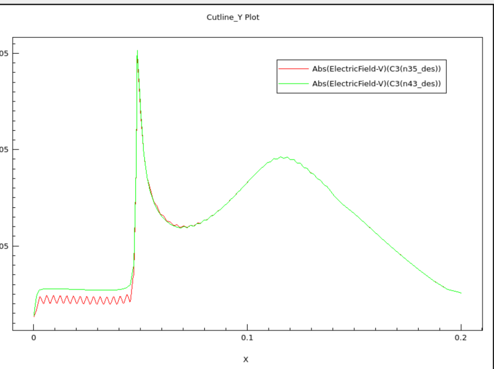
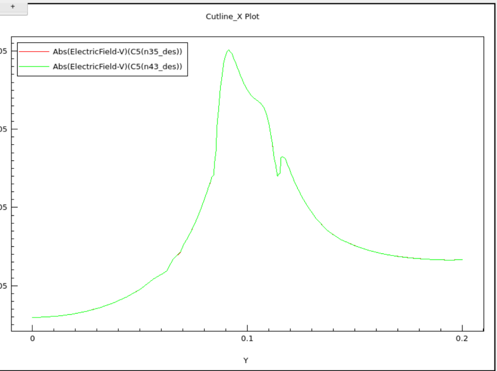

# Run 02 — DC Base-Mesh Convergence

## Status

**Completed — PASS**

Run 02 evaluated numerical mesh sensitivity of the fixed B0 baseline without changing device geometry, doping, contacts, or physical models.

## Goal

- Keep the Run 0/Run 1 B0 geometry fixed.
- Compare Coarse / Medium / Fine-local regional meshes.
- Reuse the frozen Run 1 DC protocol.
- Select the least-expensive mesh that is numerically converged for the current DC metrics.
- Treat BTBT/GIDL-specific mesh validation as a later Run 3 task.

## Fixed B0 conditions

| Item | Value |
|---|---|
| Model | B0 — 20 nm-Class Simplified 2D BCAT |
| MEB / gate-top depth | 36 nm |
| Lgate | 20 nm |
| Recess depth | 120 nm |
| Oxide liner | 5 nm |
| Geometrical S/D junction depth | 48 nm |
| S/D lateral setback | 15 nm |
| Body doping | B, 1e17 cm^-3 |
| S/D doping | As, 1e20 cm^-3 |
| Gate work function | 4.8 eV |
| Temperature | 300 K |
| BTBT/GIDL | Disabled |

## Mesh parameterization

`Mesh_Code` was added to the SDE mesh section. Geometry/material/contact/doping sections were kept unchanged.

| Mesh | Mesh_Code | Global max/min | Gate/trench max/min | Junction max/min | Points | Elements |
|---|---:|---|---|---|---:|---:|
| Coarse | 0 | 15 / 3 nm | 5 / 1 nm | 6 / 1.5 nm | 1,456 | 3,187 |
| Medium | 1 | 10 / 2 nm | 3 / 0.5 nm | 4 / 1 nm | 4,571 | 9,657 |
| Fine-local | 2 | 10 / 2 nm | 2 / 0.4 nm | 2.5 / 0.7 nm | 4,993 | 10,513 |

The Medium mesh is the same reference mesh used in Run 0/Run 1. Fine-local increases refinement mainly in the active gate/trench and junction regions rather than uniformly refining the full bulk.

## Electrical simulation matrix

For each mesh:

- `VD = 0.05 V`, `VG = 0 → 1.5 V`
- `VD = 1.0 V`, `VG = 0 → 1.5 V`
- 301 requested gate points at 5 mV spacing
- `VG_MaxStep = 0.010` as the internal quasistationary step parameter
- Run 1 physics retained
- BTBT/GIDL disabled

Total: **6 Id–Vg simulations**.

| VD = 0.05 V | VD = 1.0 V |
|---|---|
|  |  |

## Internal DC extraction protocol

Run 1 definitions were reused without modification:

- `Vth`: semilog interpolation at `|Id| = 1e-9 A`
- `SS`: linear fit of `log10(|Id|)` over `1e-14 ≤ |Id| ≤ 1e-10 A`
- `Ion`: `|Id|` at `VG = 1.5 V`, `VD = 1.0 V`
- `DIBL = (Vth@0.05V - Vth@1.0V) / 0.95`

These are internal comparison metrics for the simplified raw 2D model; they are not calibrated production-cell metrics.

## DC convergence result

| Metric | Coarse | Medium | Fine-local |
|---|---:|---:|---:|
| Vth @ VD=0.05 V | 0.915309 V | 0.932629 V | 0.932682 V |
| Vth @ VD=1.0 V | 0.875677 V | 0.887843 V | 0.887902 V |
| SS @ VD=0.05 V | 105.105 mV/dec | 106.817 | 106.802 |
| SS @ VD=1.0 V | 105.476 mV/dec | 106.975 | 106.964 |
| Ion | 5.181612e-06 A | 4.141341e-06 A | 4.138496e-06 A |
| DIBL | 41.718 mV/V | 47.143 | 47.137 |

Medium → Fine differences:

- `ΔVth(low VD) = 0.053 mV`
- `ΔVth(high VD) = 0.058 mV`
- `ΔSS(low/high) = 0.015 / 0.010 mV/dec`
- `ΔIon = 0.069 %`
- `ΔDIBL = 0.006 mV/V`

Coarse produced material DC differences, while Medium and Fine-local were numerically consistent under the frozen Run 1 protocol.

## Electric-field spatial check

Medium and Fine-local were additionally compared at the final high-drain ON-state point:

- `VD = 1.0 V`
- `VG = 1.5 V`
- quantity: `Abs(ElectricField-V)`

| Medium | Fine-local |
|---|---|
|  |  |

Three cutlines were retained as Run 2 evidence:

1. **Drain-side trench wall:** `Y = 0.116 um`, X-direction
2. **Drain-side junction:** `Y = 0.131 um`, X-direction
3. **Below trench bottom:** `X = 0.121 um`, Y-direction

| Wall, Y=0.116 um | Junction, Y=0.131 um |
|---|---|
|  |  |

The principal field profiles and peak locations were visually coincident between Medium and Fine-local in the retained cuts. The earlier exploratory `Y=0.121 um` X-cut is intentionally excluded because it was not the final trench-bottom cut definition.

## Exit decision

**Selected DC base mesh: Medium**

- Points: **4,571**
- Elements: **9,657**
- Identifier: `Mesh-DC`

Reason:

- Coarse was not sufficiently converged in the current DC metrics.
- Fine-local increased points by approximately 9.2% and elements by 8.9% relative to Medium.
- That added mesh cost changed the principal DC metrics only at a negligible level for the current protocol.
- Spatial E-field checks did not reveal a material Medium/Fine-local profile shift in the retained cutlines.

## Limitation

This result establishes only a **selected DC base mesh**. It does not prove that Medium is the final mesh for BTBT/GIDL generation, capacitance extraction, retention, or other later physics. Run 3 starts from Mesh-DC and adds physics-specific local refinement only if the GIDL hotspot requires it.

## Next step

**Run 03 — BTBT/GIDL feasibility and Mesh-GIDL validation**

B0 geometry, MEB=36 nm, and Mesh-DC=Medium remain fixed for the first Run 3 batch.
