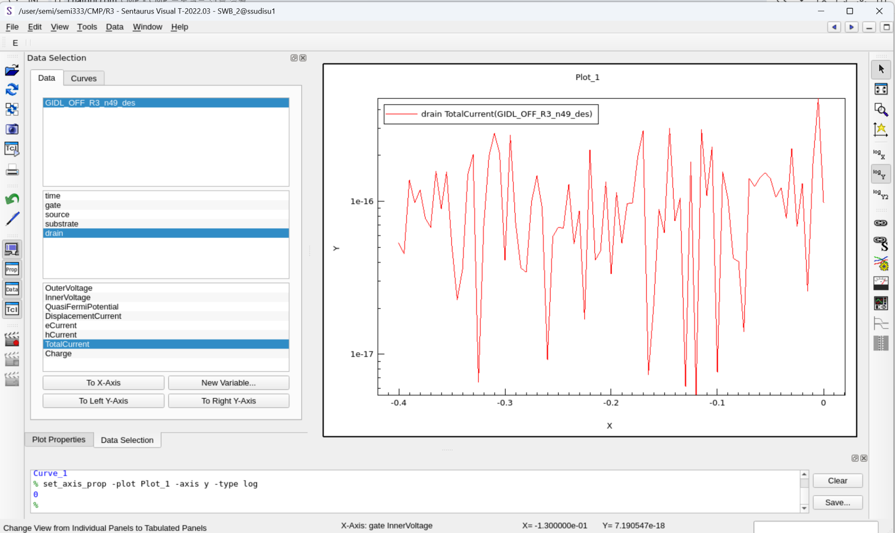
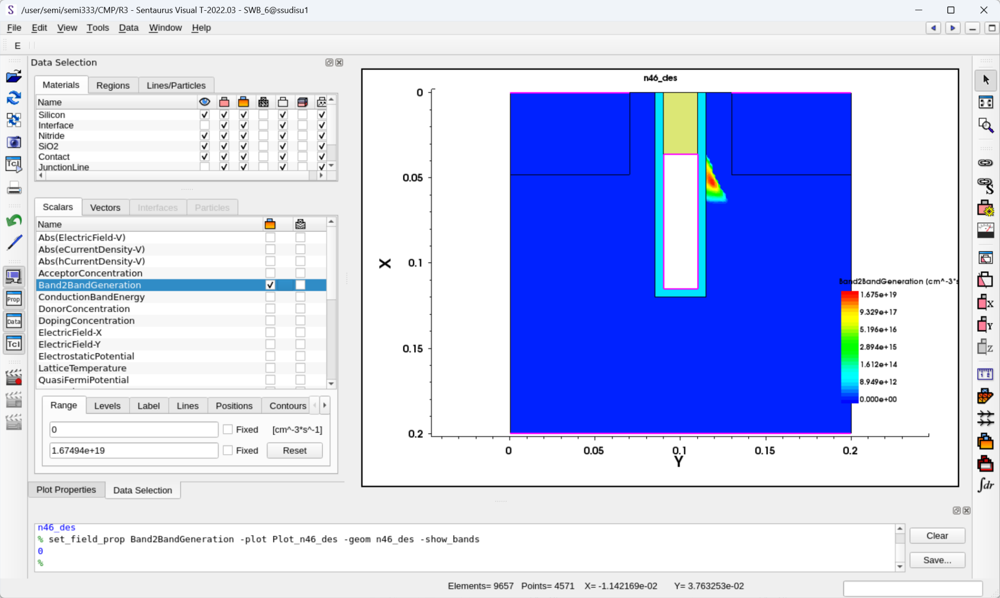
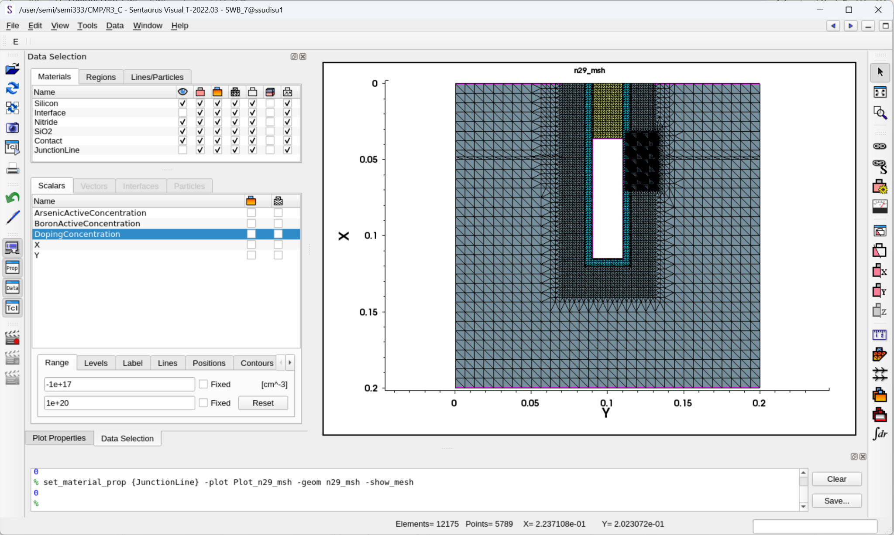
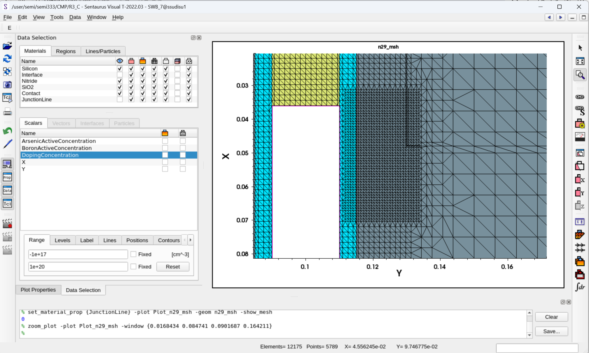
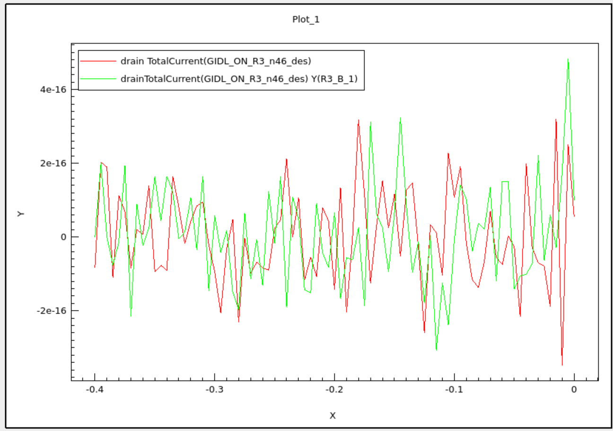
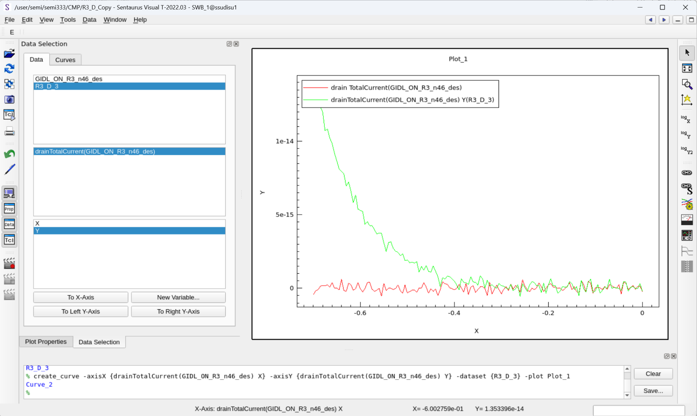
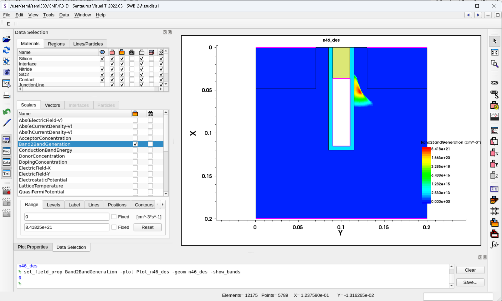
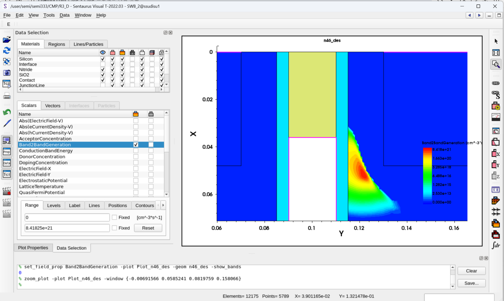
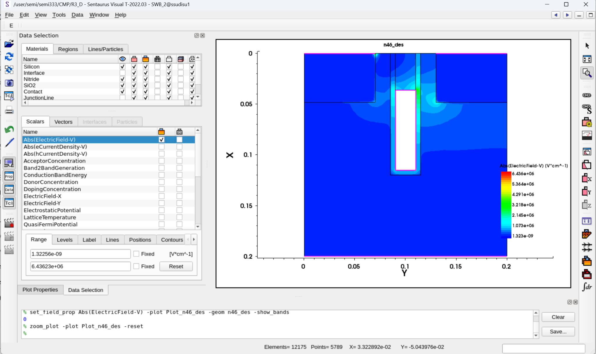
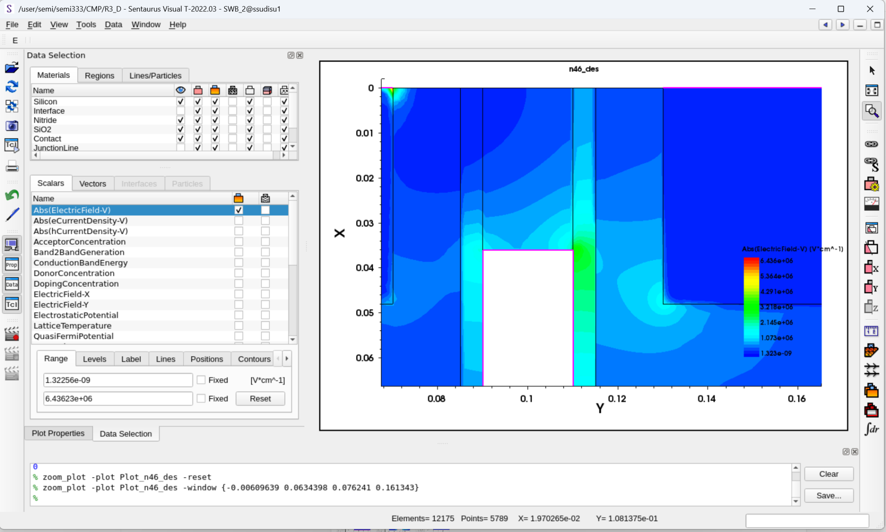

# Run 3 — BTBT/GIDL Feasibility and Mesh-GIDL

## 1. Objective

Run 3 tested whether the simplified 2D B0 model supports an internal NonlocalPath BTBT/GIDL comparison path. The sequence separated the BTBT-off numerical floor from the enabled-physics response, located the generation region, added physics-specific local mesh refinement, and froze a repeatable bias protocol for relative Run 4 comparisons.

This run does not calibrate absolute GIDL or reproduce a production DRAM cell.

## 2. Fixed B0 Conditions

| Item | Value |
|---|---|
| Model | B0 — 20 nm-Class Simplified 2D BCAT Baseline |
| MEB / gate-top depth | 0.036 um (36 nm) |
| Geometry | Rectangular B0; single work function; abrupt S/D approximation |
| Gate work function | 4.8 eV |
| Temperature | 300 K |
| Initial mesh | Medium / `Mesh_Code=1` / `Mesh-DC` |

Geometry, contacts, doping, and the single-work-function baseline remained fixed throughout Run 3.

## 3. R3-A — BTBT-OFF Reference

The archived [`bcat_gidl_r3_precheck.cmd`](../../code/sdevice/run03/bcat_gidl_r3_precheck.cmd) is the actual R3-A deck. It uses `VD=1.0 V`, `VG=0 -> -0.4 V`, Medium mesh, 300 K, and no Band2Band model. The raw terminal exports contain 81 rows on a 5 mV gate-voltage grid.



The signed drain current repeatedly changes sign and remains sensitive to the numerical floor. This branch is a BTBT-off reference and is not labeled GIDL.

## 4. R3-B — NonlocalPath Feasibility

The archived [`bcat_gidl_r3_nonlocal.cmd`](../../code/sdevice/run03/bcat_gidl_r3_nonlocal.cmd) keeps the R3-A mesh and bias conditions and enables:

```text
Band2Band(Model=NonlocalPath)
```

The first-batch terminal-current response remains weak and is not treated as calibrated GIDL. The spatial result is nevertheless mechanism-relevant: `Band2BandGeneration` is localized near the drain-side gate/junction vicinity.



## 5. R3-C — Mesh-GIDL

The corrected successful [`bcat_baseline_sde_r3_meshgidl.cmd`](../../code/sde/run03/bcat_baseline_sde_r3_meshgidl.cmd) preserves the Medium base mesh and activates an extra local window only for `Mesh_Code=3`:

| Setting | Value |
|---|---|
| X window | 0.032–0.070 um |
| Y window | 0.112–0.133 um |
| Local max/min | 0.0010 / 0.00025 um (1.0 / 0.25 nm) |
| Medium mesh | 4,571 points / 9,657 elements |
| Mesh-GIDL | 5,789 points / 12,175 elements |

| Mesh-GIDL full view | Drain-side hotspot zoom |
|---|---|
|  |  |

The geometry is unchanged. The refinement targets the observed drain-side BTBT-sensitive region; it is not evidence of absolute BTBT mesh independence.



## 6. R3-D — Bias Search and Final ON/OFF Attribution

Using `Mesh_Code=3`, `MEB=36 nm`, `T=300 K`, and `VD=1.2 V`, the enabled-NonlocalPath search extended the negative gate endpoint in three steps:

| Sweep | Raw rows | Requested output spacing |
|---|---:|---:|
| `VG=0 -> -0.5 V` | 101 | 5 mV |
| `VG=0 -> -0.6 V` | 121 | 5 mV |
| `VG=0 -> -0.7 V` | 141 | 5 mV |
| Final BTBT-off, `VG=0 -> -0.7 V` | 141 | 5 mV |

The final raw ON and OFF CSVs directly verify the 141-point grid. The OFF CSV header still contains the internal dataset label `GIDL_ON_R3_n46_des`; this is a source naming artifact, and the raw file is intentionally preserved without editing.

At the original Run 3 close-out, the exact standalone final R3-D ON/OFF decks were not present in the supplied package and the raw CSVs/screenshots remained the final quantitative source of truth. During the 2026-08-28 TCAD archive recovery, representative final ON/OFF executed snapshots were recovered and committed for provenance:

- [`bcat_gidl_r3_final_nonlocal_on_executed_snapshot.cmd`](../../code/sdevice/run03/bcat_gidl_r3_final_nonlocal_on_executed_snapshot.cmd)
- [`bcat_gidl_r3_final_nonlocal_off_executed_snapshot.cmd`](../../code/sdevice/run03/bcat_gidl_r3_final_nonlocal_off_executed_snapshot.cmd)

These recovered snapshots improve source traceability; they do not change the Run 3 quantitative result, which remains anchored to the committed raw CSVs.

## 7. Quantitative ON/OFF Comparison

The final raw drain-current CSVs give the following endpoint at `VG=-0.700 V`:

| Case | Signed drain current | Magnitude |
|---|---:|---:|
| NonlocalPath BTBT ON | `+1.3777737e-14 A` | `1.3777737e-14 A` |
| BTBT OFF | `-4.2880983e-16 A` | `4.2880983e-16 A` |
| Magnitude ratio, ON/OFF | — | `32.13017994` |

The values and selected intermediate points are reproduced without smoothing in [`r3d_btbt_on_off_summary.csv`](../../data/run03/processed/r3d_btbt_on_off_summary.csv).



## 8. Spatial Mechanism Evidence

Within the simplified 2D B0 model and the selected internal off-state bias protocol, enabling NonlocalPath BTBT produces a drain-terminal leakage branch that is absent in the BTBT-off reference, while `Band2BandGeneration` is localized near the drain-side gate/junction region.

| Band2BandGeneration full view | Drain-side zoom |
|---|---|
|  |  |

The ElectricField views are retained only as qualitative location evidence. Their global SVisual color-bar maximum is not promoted to a formally extracted `Emax` metric.

| ElectricField full view | Drain-side zoom |
|---|---|
|  |  |

## 9. Mesh-GIDL Decision

`Mesh-DC = Medium / Mesh_Code 1` remains the DC mesh. `Mesh-GIDL = Mesh_Code 3` is selected for subsequent relative GIDL comparisons because it retains the Medium base mesh and adds targeted refinement around the observed generation region. This is a project-internal, physics-specific mesh decision, not absolute BTBT calibration or proof of mesh-independent absolute leakage.

## 10. G1 Corner-Rounding Review

**G1 reviewed — not activated.** Rectangular B0 is retained for Run 4. Corner rounding remains a conditional sensitivity branch if later field or BTBT evidence becomes corner-dominated.

## 11. Limitations

- Absolute production-cell GIDL and experimental BTBT calibration are not established.
- The signed current is raw simplified-2D terminal current used for internal relative comparison.
- Final R3-D ON/OFF representative executed snapshots are now archived for provenance, while the committed raw CSVs remain the quantitative source of truth.
- No final R3-D four-terminal export is available, so no numerical KCL error is claimed.
- Cov/Cgd, temperature dependence, retention, refresh burden, and a robust process window remain unverified.
- The 31/36/41 nm development cases are not a Run 3 DOE, and no formal MEB optimization is claimed.
- Run 3 does not activate a rounded-corner proposed geometry.

## 12. Exit Criteria

Run 3 is **Completed — PASS** because:

- the BTBT-off reference is identified as numerical-floor-sensitive;
- NonlocalPath produces a bias-dependent drain leakage branch under the final internal protocol;
- `Band2BandGeneration` is localized near the drain-side gate/junction region;
- a targeted Mesh-GIDL definition is archived without changing geometry; and
- final ON/OFF raw data reproduce the 141-point sweep and endpoint comparison.

## 13. Frozen Protocol for Run 4

Run 4 relative GIDL comparisons use:

```text
MEB nominal reference = 36 nm
Mesh = Mesh-GIDL / Mesh_Code 3
T = 300 K
VD = 1.2 V
VG sweep = 0 -> -0.7 V
requested output grid = 5 mV
BTBT = NonlocalPath ON
primary internal leakage metric = |Idrain| at VG=-0.7 V
B0 nominal reference = 1.3777737e-14 A
```

This is an internal relative simplified-2D metric. Run 4 is the next stage and has no results yet.