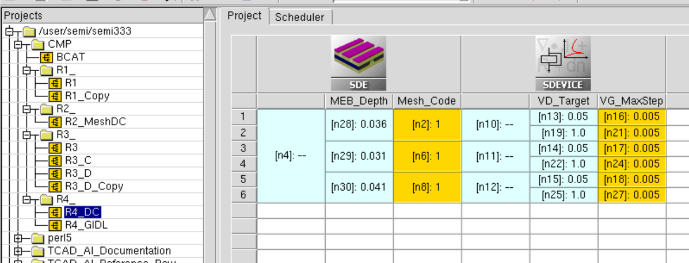
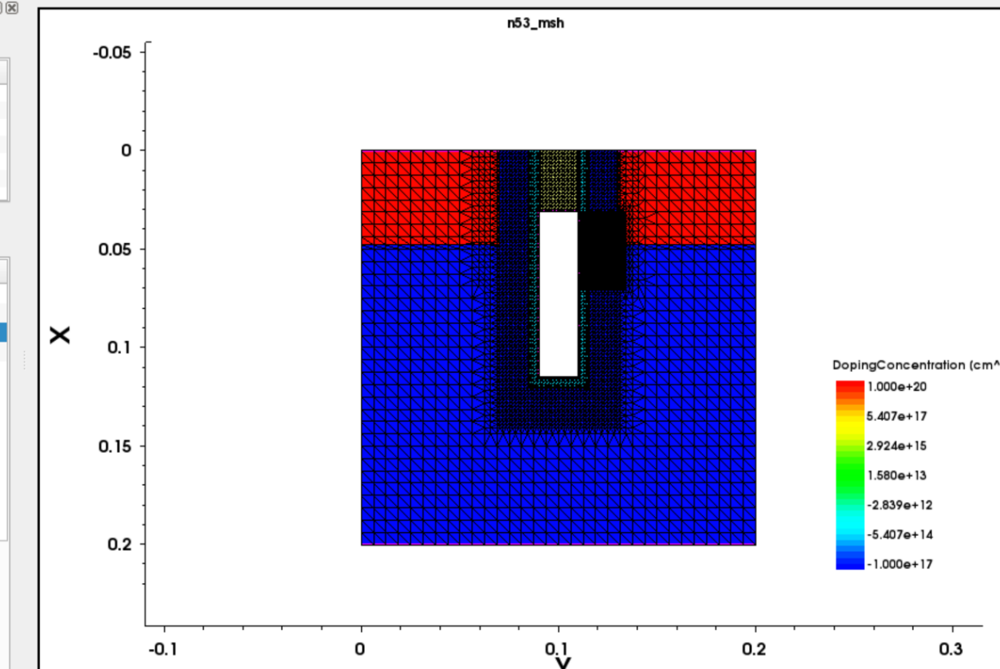
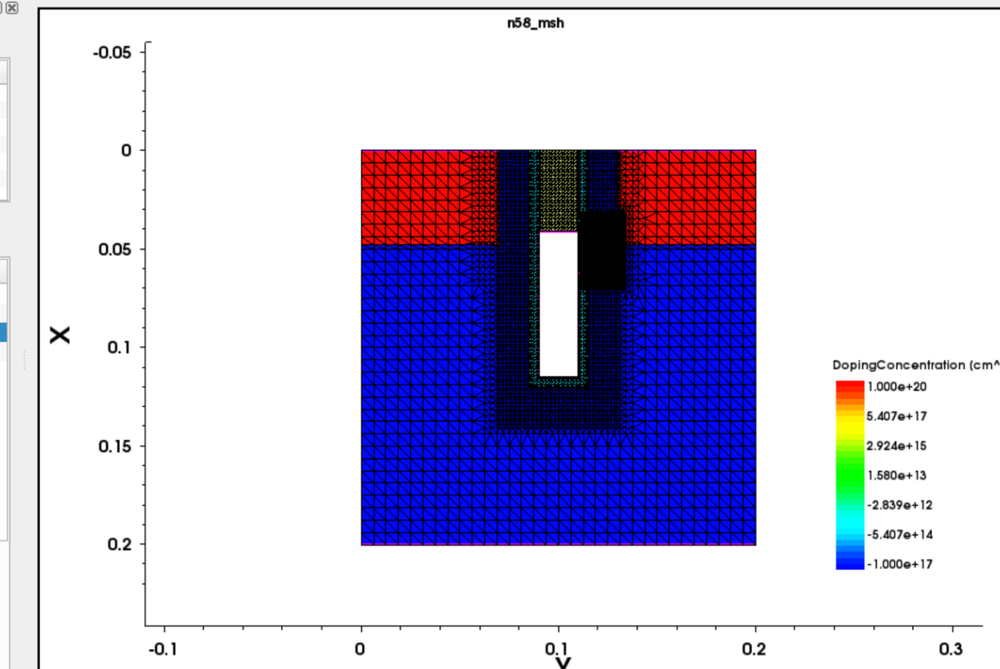
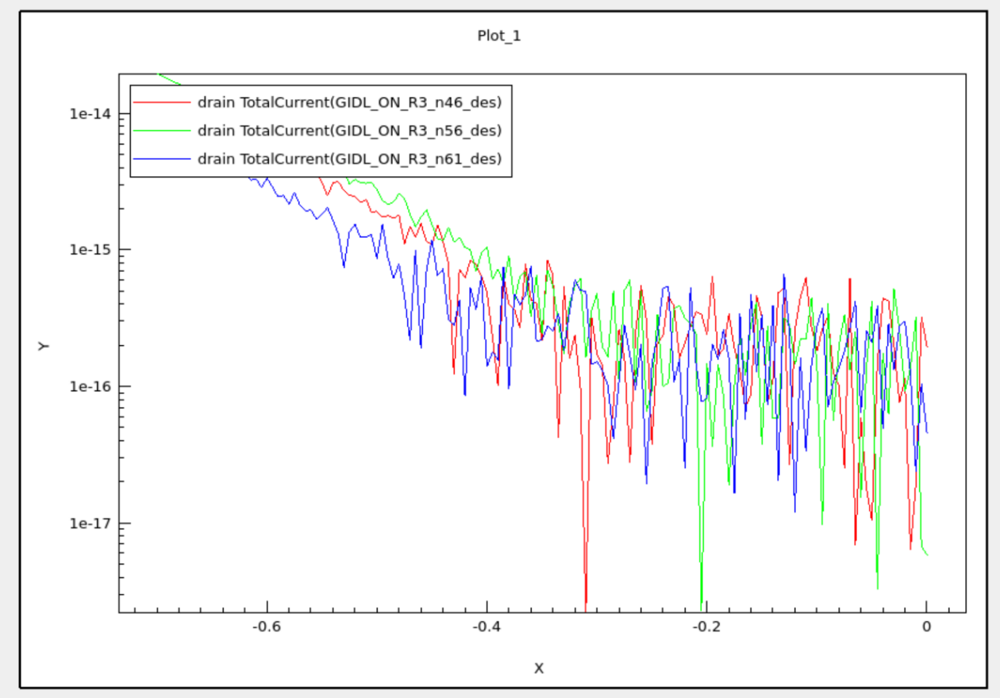
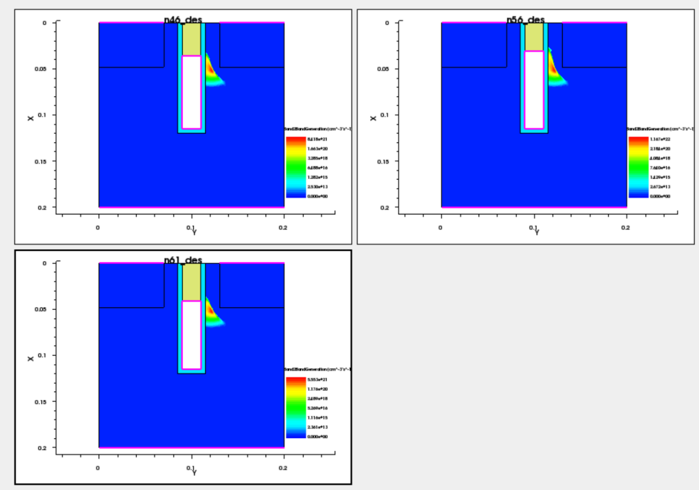
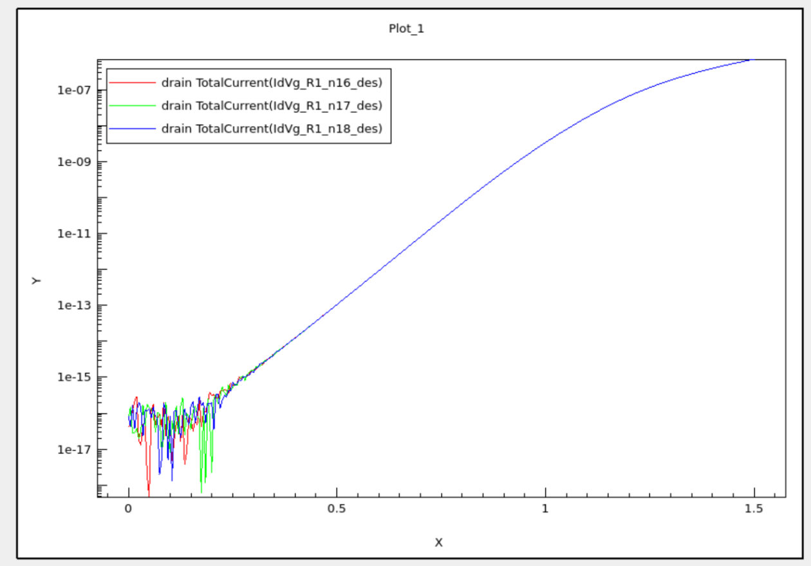
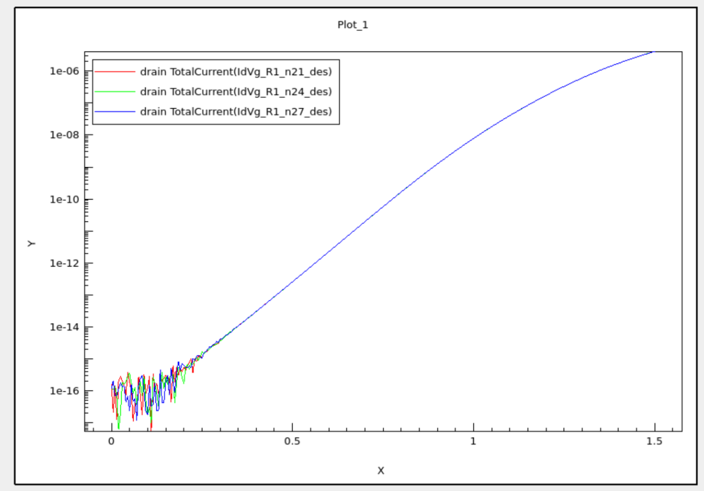

# Run 4 — Formal MEB 3-Level Screening

## 1. Objective

Run 4 converts the earlier 31/36/41 nm parameterization dry-run into a **fresh formal MEB screening**. The purpose is to determine whether MEB/gate-top depth changes the project-internal drain-side BTBT/GIDL metric and whether that change carries a measurable DC penalty under the already frozen comparison protocols.

This run does **not** calibrate absolute production-cell GIDL, establish a final global optimum, extract Cov/Cgd, or demonstrate retention/refresh improvement.

## 2. Fixed Model and Protocols

| Item | Value |
|---|---|
| Model | B0 family — 20 nm-Class Simplified 2D BCAT |
| MEB levels | 31 / 36 / 41 nm |
| Gate work function | 4.8 eV, single-WF |
| Temperature | 300 K |
| S/D | Abrupt constant-doped simplified regions |
| Geometry changes | MEB/gate-top depth only |
| Corner rounding | OFF / not activated |

### GIDL protocol

```text
Mesh = Mesh-GIDL / Mesh_Code 3
VD = 1.2 V
VG = 0 -> -0.7 V
requested output spacing = 5 mV
Band2Band(Model=NonlocalPath) ON
primary metric = |Idrain| at VG=-0.7 V
```

### DC guardrail protocol

```text
Mesh = Mesh-DC / Mesh_Code 1
VD = 0.05 V and 1.0 V
VG = 0 -> 1.5 V
requested output spacing = 5 mV
VG_MaxStep = 0.005 V
BTBT OFF
```

Frozen extraction definitions are the Run 1 definitions: Vth at `|Id|=1e-9 A`, SS fit over `1e-14 <= |Id| <= 1e-10 A`, Ion at `VG=1.5 V, VD=1.0 V`, and DIBL = `(Vth_low - Vth_high)/0.95`.

## 3. Formal Simulation Matrix

Run 4 reran all three MEB levels in the formal projects rather than reusing the old development-only 31/41 nm outputs.

### GIDL matrix

| MEB | Mesh_Code | VD | VG range | BTBT | Rows |
|---:|---:|---:|---|---|---:|
| 31 nm | 3 | 1.2 V | 0 to -0.7 V | NonlocalPath ON | 141 |
| 36 nm | 3 | 1.2 V | 0 to -0.7 V | NonlocalPath ON | 141 |
| 41 nm | 3 | 1.2 V | 0 to -0.7 V | NonlocalPath ON | 141 |

### DC matrix

| MEB | Mesh_Code | VD | VG range | VG_MaxStep | Rows |
|---:|---:|---:|---|---:|---:|
| 31 nm | 1 | 0.05 V | 0 to 1.5 V | 0.005 V | 301 |
| 31 nm | 1 | 1.0 V | 0 to 1.5 V | 0.005 V | 301 |
| 36 nm | 1 | 0.05 V | 0 to 1.5 V | 0.005 V | 301 |
| 36 nm | 1 | 1.0 V | 0 to 1.5 V | 0.005 V | 301 |
| 41 nm | 1 | 0.05 V | 0 to 1.5 V | 0.005 V | 301 |
| 41 nm | 1 | 1.0 V | 0 to 1.5 V | 0.005 V | 301 |



## 4. Geometry and Mesh Sanity

The same parameterized SDE definition was used for all three MEB levels. `Mesh_Code=1` retains the Medium DC base mesh, while `Mesh_Code=3` retains the same Medium base plus the Run 3 drain-side BTBT hotspot window. Geometry, contacts, doping, gate bottom, junction depth, and the rectangular B0 topology were not intentionally changed.

Observed Mesh-GIDL counts were:

| MEB | Points | Elements |
|---:|---:|---:|
| 31 nm | 5,739 | 12,063 |
| 36 nm | 5,789 | 12,175 |
| 41 nm | 5,830 | 12,273 |

| 31 nm Mesh-GIDL | 41 nm Mesh-GIDL |
|---|---|
|  |  |

The drain-side targeted window continued to cover the localized generation region across the 3-level split. No new overlap, short, or disconnected-region issue was identified from the retained sanity evidence.

## 5. Formal GIDL Screening

The endpoint metric extracted directly from the raw CSV at `VG=-0.700 V` is:

| MEB | `|Idrain|` (A) | Normalized to 36 nm | Change vs 36 nm |
|---:|---:|---:|---:|
| 31 nm | `1.9624468e-14` | `1.424361` | `+42.4%` |
| 36 nm | `1.3777737e-14` | `1.000000` | reference |
| 41 nm | `7.7683012e-15` | `0.563830` | `-43.6%` |



Within the screened 31–41 nm range, increasing MEB/gate-top depth produces a clear reduction in the project-internal terminal GIDL metric. This is a **screening-range direction**, not proof that 41 nm is the global or final optimum.

## 6. Spatial BTBT Evidence

`Band2BandGeneration` remains localized near the drain-side gate/junction vicinity for all three formal MEB cases. The footprint changes qualitatively with MEB in a direction consistent with the terminal-current screening result.



The SVisual panels use automatic and different color scales. Therefore the screenshots are used to compare **location, footprint, and qualitative redistribution only**. Their color-bar maxima are not promoted to a formal generation-peak metric or `Emax`.

## 7. DC Guardrail Results

The six raw Id–Vg CSVs were re-extracted using the frozen Run 1 definitions.

| MEB | Vth @ 0.05 V | Vth @ 1.0 V | SS @ 0.05 V | SS @ 1.0 V | Ion | DIBL |
|---:|---:|---:|---:|---:|---:|---:|
| 31 nm | 0.932629 V | 0.887856 V | 106.807 mV/dec | 106.936 mV/dec | 4.1417612e-6 A | 47.129 mV/V |
| 36 nm | 0.932629 V | 0.887843 V | 106.817 mV/dec | 106.975 mV/dec | 4.1413410e-6 A | 47.143 mV/V |
| 41 nm | 0.932631 V | 0.887819 V | 106.849 mV/dec | 106.984 mV/dec | 4.1404784e-6 A | 47.170 mV/V |

| Low-VD Id–Vg | High-VD Id–Vg |
|---|---|
|  |  |

Relative to 36 nm, the largest observed changes across the screened range are only about `0.024 mV` in Vth, `0.04 mV/dec` in SS, `0.027 mV/V` in DIBL, and `0.021%` in Ion. Thus no material DC penalty is resolved within this 31–41 nm screening range and the current internal metric resolution. This statement is intentionally limited to the present simplified model and frozen DC protocol.

## 8. Combined Screening Table

| MEB | Normalized GIDL | Ion (A) | DIBL (mV/V) | Screening interpretation |
|---:|---:|---:|---:|---|
| 31 nm | 1.424 | 4.1417612e-6 | 47.129 | higher GIDL than nominal |
| 36 nm | 1.000 | 4.1413410e-6 | 47.143 | B0 nominal reference |
| 41 nm | 0.564 | 4.1404784e-6 | 47.170 | lowest GIDL among screened levels; not a final optimum |

The formal 3-level result therefore supports the statement: **deeper MEB is the favorable direction for the internal GIDL metric over 31–41 nm, while the frozen DC guardrail remains essentially unchanged.**

## 9. Limitations

- Currents are raw simplified-2D terminal currents; no production-cell absolute-current calibration is claimed.
- The NonlocalPath BTBT model is used as the frozen internal comparison physics; experimental BTBT calibration is not established.
- R4 does not formally extract `Emax`; ElectricField/Band2BandGeneration contours remain supporting spatial evidence.
- Automatic SVisual color scales differ between some spatial panels, so absolute contour-color comparisons are not used quantitatively.
- The three levels establish a coarse local trend only. Because 41 nm is the boundary of the screened set, it must not be called the global optimum.
- Cov/Cgd, temperature dependence, retention, refresh burden, variation-aware design window, Dual-WF extension, and rounded-corner sensitivity remain outside the completed Run 4 scope.

## 10. Exit Criteria

Run 4 is **Completed — PASS** because:

1. all three formal MEB geometries remained usable under the frozen topology;
2. all three GIDL sweeps produced interpretable 141-row endpoint data;
3. the drain-side `Band2BandGeneration` region remained localized and within the Mesh-GIDL targeted area;
4. a clear MEB-dependent internal GIDL trend was resolved above the nominal comparison level; and
5. corresponding Vth/SS/Ion/DIBL guardrails were quantified under an unchanged DC protocol.

## 11. Handoff

Run 4 closes the first formal structural screening. Under the current Run Sheet v5, the next technical entry is **Run 5A — Cov/Cgd feasibility**, while the 3-to-5-level MEB expansion belongs to conditional Run 5B after the Cov extraction path is assessed. The Run 4 result is already sufficient to provide a provisional baseline-versus-screened-candidate comparison for the September milestone, but it does not finalize a production design optimum.
