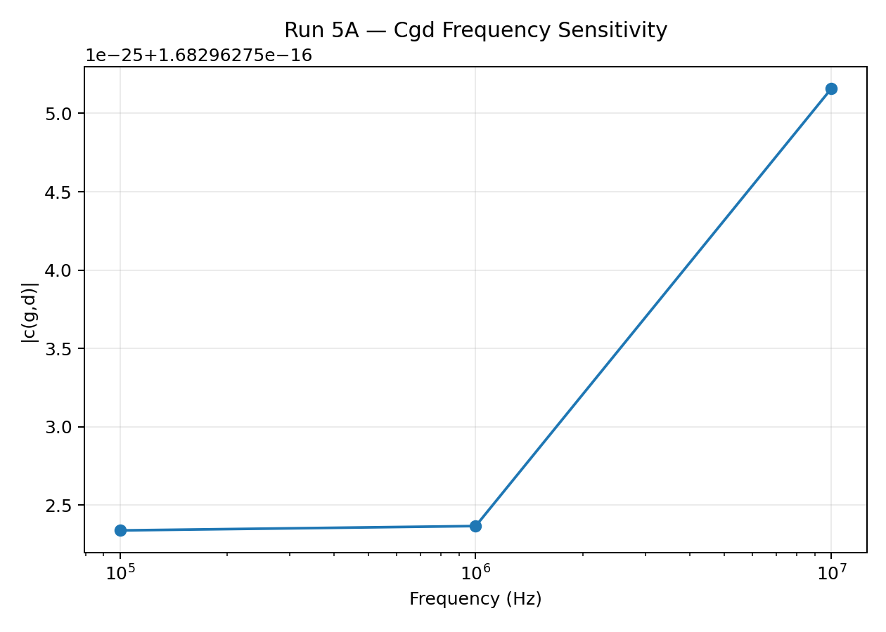
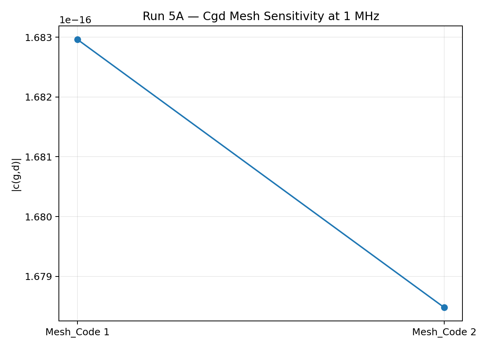
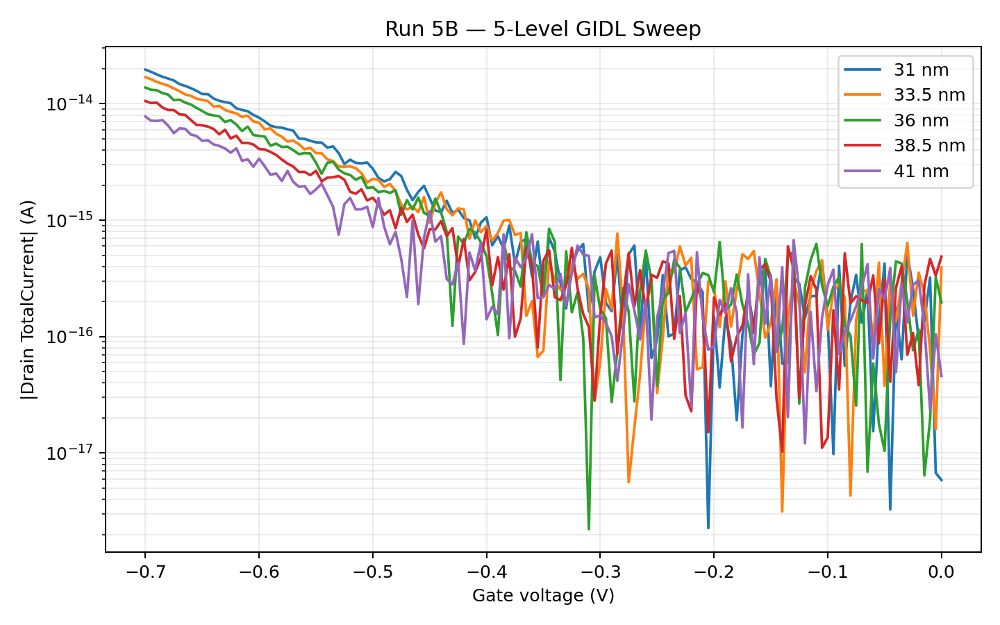
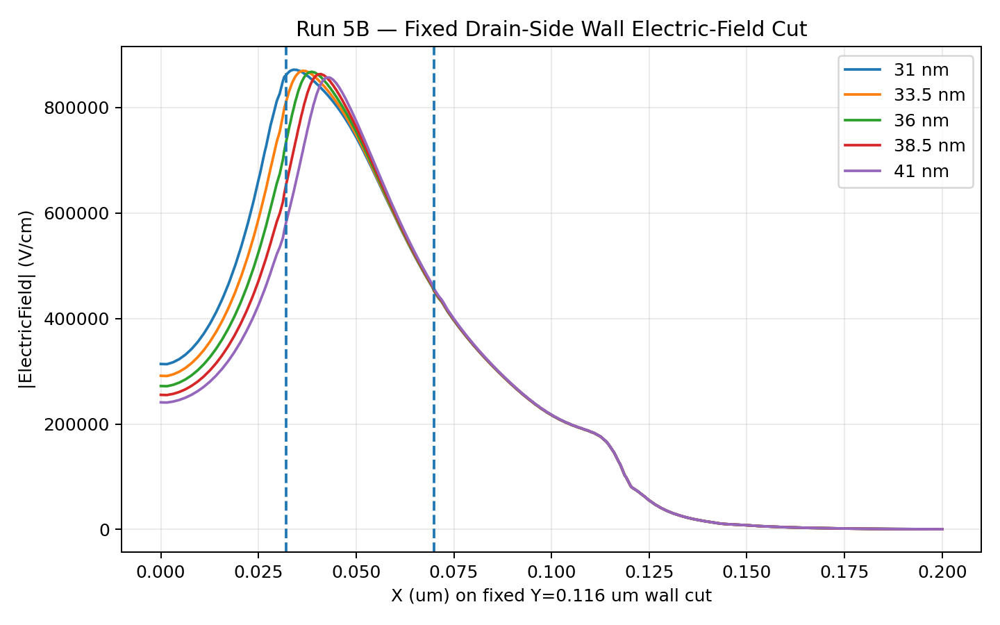
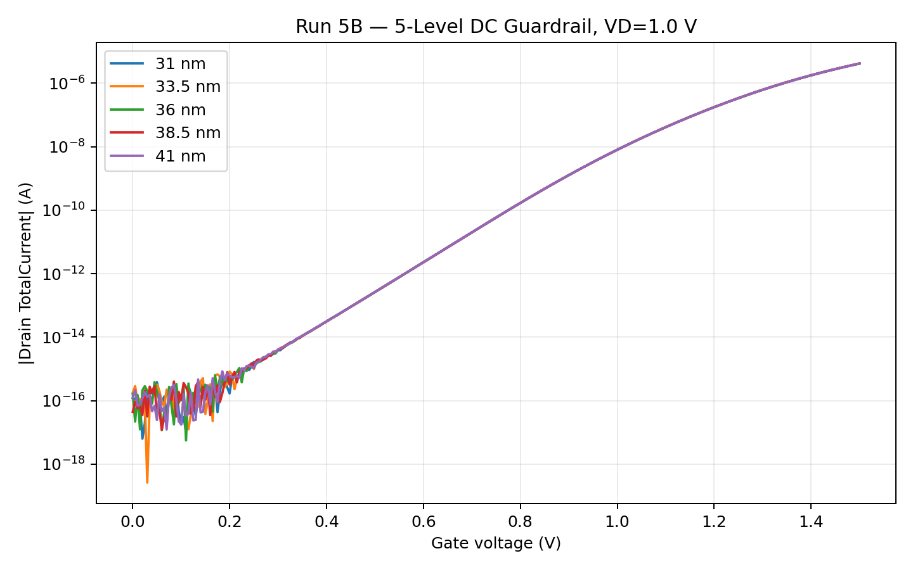
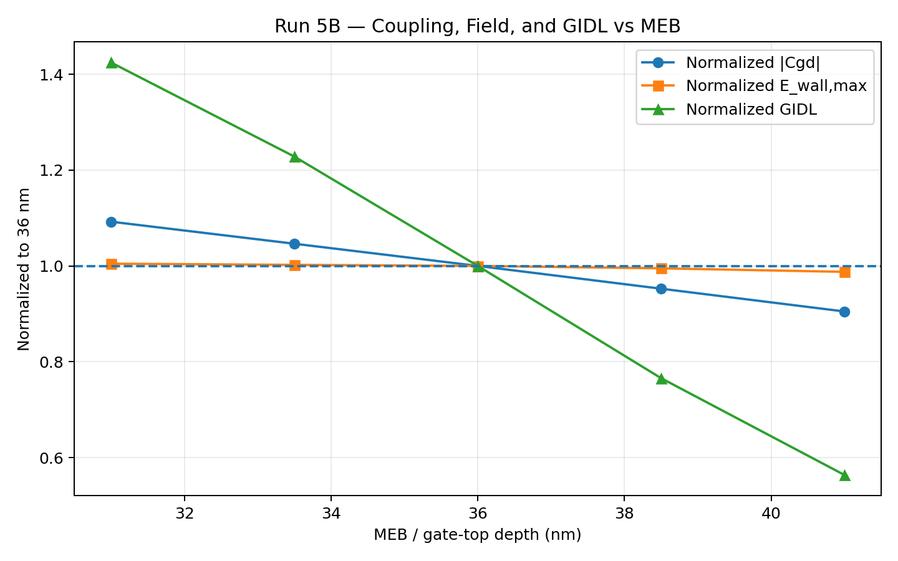
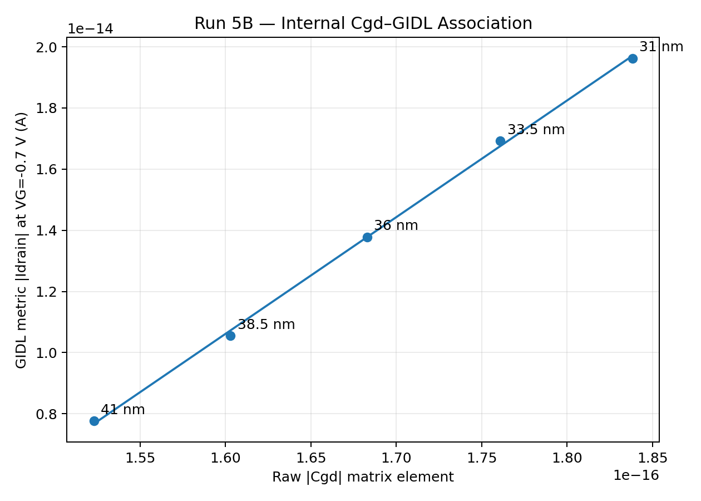

# Run 05 — Cov/Cgd Feasibility and Formal MEB–Cgd–Field–GIDL Correlation

## 1. Status

**Completed — PASS**

Run 5 first established a repeatable project-internal small-signal gate–drain coupling
metric, then expanded the formal MEB study from 3 to 5 levels and linked that metric to
a fixed drain-side field metric and the frozen NonlocalPath GIDL comparison.

No production-cell absolute Cov, calibrated GIDL, retention, or refresh result is claimed.

## 2. Handoff from Run 4

Run 4 established the formal 31/36/41 nm MEB direction:

- deeper MEB reduced the project-internal GIDL metric over 31–41 nm;
- no material Vth/SS/Ion/DIBL penalty was resolved under the frozen DC protocol;
- 41 nm was the lowest-GIDL screened boundary point, not a global optimum.

Run 5 addresses the missing coupling/electrostatic evidence and refines the MEB sweep.

## 3. R5A — Cgd feasibility and validation

### 3.1 AC path

Sentaurus Device `ACCoupled` syntax was verified from the installed T-2022.03
Applications Library and adapted to the B0 four-terminal structure.

`ACExtract` produced the full small-signal matrix. The formal internal comparison uses:

```text
primary metric = |c(g,d)|
cross-check    = |c(d,g)|
```

The raw matrix element is treated as a **project-internal gate–drain small-signal coupling
metric**, not a calibrated production-cell Cov.

### 3.2 Bias selection

The path was checked at:

- VD=0 V, VG≈0 V;
- VD=1.2 V, VG≈0 V;
- VD=1.2 V, VG≈-0.7 V.

The formal Run 5 comparison point is:

```text
MEB = 36 nm nominal reference
Mesh_Code = 1
T = 300 K
VD = 1.2 V
VG = -0.70 V
f = 1 MHz
BTBT = OFF
```

Nominal `|c(g,d)| = 1.682962752365770e-16`.

### 3.3 Frequency sensitivity

At VD=1.2 V and VG=-0.70 V:

| Frequency | `|c(g,d)|` |
|---:|---:|
| 100 kHz | `1.68296275233783e-16` |
| 1 MHz | `1.68296275236577e-16` |
| 10 MHz | `1.68296275515910e-16` |

The full 100 kHz–10 MHz variation is negligible for the current model.
**1 MHz** is therefore retained as the representative project-internal frequency.



### 3.4 Mesh sensitivity

At the same nominal point:

| Mesh | `|c(g,d)|` |
|---|---:|
| Mesh_Code 1 | `1.68296275236577e-16` |
| Mesh_Code 2 | `1.67847784107607e-16` |

Difference: approximately **0.2665%**.

`Mesh_Code=1 / Medium` is therefore retained for Run 5 Cgd comparisons.



### 3.5 R5A exit

**PASS.** No additional R5A frequency or mesh simulations are required.

## 4. R5B — Formal five-level matrix

Formal MEB levels:

```text
31.0 / 33.5 / 36.0 / 38.5 / 41.0 nm
```

| Branch | Mesh | Bias / condition | Formal metric |
|---|---|---|---|
| Cgd | Mesh_Code 1 | VD=1.2 V, VG=-0.70 V, 1 MHz, BTBT OFF | `|c(g,d)|` |
| GIDL | Mesh_Code 3 | VD=1.2 V, VG=0→-0.7 V, NonlocalPath ON | `|Idrain| @ VG=-0.7 V` |
| Field | Mesh_Code 3 | final GIDL TDR, VD=1.2 V, VG=-0.7 V | `E_wall,max` |
| DC | Mesh_Code 1 | VD=0.05/1.0 V, VG=0→1.5 V, BTBT OFF | Vth/SS/Ion/DIBL |

## 5. Formal five-level Cgd

| MEB | `|Cgd|` raw | Normalized to 36 nm |
|---:|---:|---:|
| 31.0 | `1.838254858162e-16` | `1.092273` |
| 33.5 | `1.760831943460e-16` | `1.046269` |
| 36.0 | `1.682962752366e-16` | `1.000000` |
| 38.5 | `1.602985889683e-16` | `0.952479` |
| 41.0 | `1.523009151156e-16` | `0.904957` |

31→41 nm reduces the project-internal `|Cgd|` metric by approximately
**17.15%**.

The five formal cases satisfy `c(g,d) ≈ c(d,g)` to numerical precision.

## 6. Formal five-level GIDL

| MEB | `|Idrain| @ VG=-0.7 V` | Normalized to 36 nm |
|---:|---:|---:|
| 31.0 | `1.9624468e-14 A` | `1.424361` |
| 33.5 | `1.6919999e-14 A` | `1.228068` |
| 36.0 | `1.3777737e-14 A` | `1.000000` |
| 38.5 | `1.0550537e-14 A` | `0.765767` |
| 41.0 | `7.7683012e-15 A` | `0.563830` |

31→41 nm reduces the project-internal GIDL endpoint by approximately
**60.42%**.

The 31/36/41 nm endpoint values reproduce the formal Run 4 values exactly.



Low-current fluctuations near VG≈0 to -0.4 V remain numerical-floor-sensitive and are
not used as the formal endpoint metric.

## 7. Formal drain-side field metric

Run 3/4 automatic SVisual color-bar maxima were never promoted to formal Emax.
Run 5 closes that gap with a fixed, reproducible metric:

```text
quantity = Abs(ElectricField-V)
source   = final Run 5B GIDL TDR
bias     = VD=1.2 V, VG=-0.7 V
cutline  = Y=0.116 um
analysis interval = X=0.032–0.070 um
metric   = E_wall,max = maximum |E| within that interval
```

This is **not global Emax**.

| MEB | `E_wall,max` (V/cm) | Peak X (um) | Normalized |
|---:|---:|---:|---:|
| 31.0 | `871969.09` | `0.03396875` | `1.004646` |
| 33.5 | `869869.56` | `0.03631250` | `1.002227` |
| 36.0 | `867936.60` | `0.03865625` | `1.000000` |
| 38.5 | `863581.96` | `0.04100000` | `0.994983` |
| 41.0 | `857194.93` | `0.04256250` | `0.987624` |

All peaks remain inside the predeclared X=0.032–0.070 um hotspot window.
The peak position shifts continuously with MEB while the peak value decreases monotonically.



## 8. Five-level DC guardrail

Run 4 already supplied formal 31/36/41 nm DC metrics. Run 5 adds only the new 33.5
and 38.5 nm levels under the formal Run 4+ solver setting `VG_MaxStep=0.005 V`.

| MEB | Vth low/high (V) | SS low/high (mV/dec) | Ion (A) | DIBL (mV/V) |
|---:|---:|---:|---:|---:|
| 31.0 | 0.932629 / 0.887856 | 106.807 / 106.936 | `4.1417612e-6` | 47.129 |
| 33.5 | 0.932629 / 0.887851 | 106.844 / 106.917 | `4.1415866e-6` | 47.135 |
| 36.0 | 0.932629 / 0.887843 | 106.817 / 106.975 | `4.1413410e-6` | 47.143 |
| 38.5 | 0.932630 / 0.887833 | 106.833 / 106.963 | `4.1409856e-6` | 47.154 |
| 41.0 | 0.932631 / 0.887819 | 106.849 / 106.984 | `4.1404784e-6` | 47.170 |

No material Vth/SS/Ion/DIBL penalty is resolved within the current model and protocol.



## 9. Combined result

| MEB | Norm. Cgd | Norm. E_wall | Norm. GIDL |
|---:|---:|---:|---:|
| 31.0 | 1.092273 | 1.004646 | 1.424361 |
| 33.5 | 1.046269 | 1.002227 | 1.228068 |
| 36.0 | 1.000000 | 1.000000 | 1.000000 |
| 38.5 | 0.952479 | 0.994983 | 0.765767 |
| 41.0 | 0.904957 | 0.987624 | 0.563830 |



Across 31→41 nm:

- `|Cgd|`: approximately **17.15% decrease**
- `E_wall,max`: approximately **1.69% decrease**
- GIDL: approximately **60.42% decrease**

## 10. Correlation

Five-point correlations are recorded for internal trend description only.

| Pair | Pearson r | Spearman rho |
|---|---:|---:|
| Cgd vs GIDL | 0.999586 | 1.000000 |
| Cgd vs E_wall | 0.967757 | 1.000000 |
| E_wall vs GIDL | 0.965410 | 1.000000 |

`n=5`; these values are **not** statistical or causal proof.



## 11. Physical interpretation

### Verified directly

- MEB increases from 31 to 41 nm.
- The project-internal Cgd metric decreases monotonically.
- The fixed drain-side wall peak field decreases monotonically.
- The NonlocalPath GIDL endpoint decreases monotonically.
- The five-level DC guardrails remain essentially unchanged.

### Supported interpretation

The common direction supports the interpretation that MEB-dependent gate–drain coupling
and drain-side electrostatics are consistent with the observed GIDL reduction.

### Not verified

Run 5 does **not** prove:

- direct causality from Cgd to GIDL;
- calibrated production-cell Cov or absolute GIDL;
- a global optimum beyond 41 nm;
- high-temperature robustness;
- retention or refresh improvement.

## 12. Candidate selection

**P1 = 41 nm** is selected for the next stage as the:

> provisional low-GIDL screened-window candidate

It has the lowest Cgd, fixed-wall field, and GIDL values among the tested 31–41 nm
levels, with no resolved material DC penalty.

It is not called a global, final, or production optimum.

## 13. Run 5 exit criteria

Run 5 is **PASS** because:

1. AC/Cgd extraction is repeatable and internally reciprocal.
2. Frequency sensitivity is negligible over 100 kHz–10 MHz.
3. Mesh_Code 1 and 2 differ by only about 0.27% in nominal Cgd.
4. Formal five-level Cgd is complete.
5. Formal five-level GIDL is complete and reproduces Run 4 overlap points.
6. Five-level DC guardrails are complete.
7. A fixed non-global drain-side field metric is quantitatively defined.
8. Cgd, E_wall,max, and GIDL show the same monotonic direction.
9. 41 nm can be carried as a provisional screened-window candidate without claiming a global optimum.

**No additional Run 5 simulation is required.**

## 14. Handoff to Run 6

Run 6 tests whether the MEB-dependent low-GIDL direction survives temperature:

```text
T = 300 / 340 / 380 K
```

The main comparison starts from B0 = 36 nm and P1 = 41 nm, with 31 nm retained as a
high-GIDL screened reference when useful. Temperature-dependent leakage-component
separation remains a Run 6 task.

## R6.5 follow-up note — 2026-08-23

Run 5 remains the formal five-point 31–41 nm correlation record. R6.5 subsequently extended
the MEB range to 51 nm and confirmed that both the project-internal Cgd metric and formal
`E_wall,max` continue decreasing beyond 41 and 48 nm.

Accordingly, the Run 5 Pearson/Spearman coefficients remain descriptive evidence for the
declared five-point range and are not extrapolated as a universal linear Cgd→GIDL predictor.

`P1=41 nm` remains the historical initial screened-window candidate.
R6.5 adds `P2=48 nm` as the extended-MEB retention-handoff candidate, while 49 nm is retained
as a challenger/sensitivity point.
