# Run 06.5 — Extended MEB Boundary Study

## 1. Status

**Completed — PASS / R6.5 frozen on 2026-08-23**

Run 6.5 was inserted after Run 6 because `P1=41 nm` was the lowest-GIDL point of the
original 31–41 nm screened range **and also the search boundary**. The purpose of this
stage was to test whether the apparent optimum was only a boundary artifact, extend the
MEB/GateTop sweep across the model-internal `Jdepth=48 nm` boundary, and define a
defensible handoff candidate for retention feasibility.

No new TCAD simulation is required for R6.5 scientific close-out.

## 2. Scope and terminology

The model remains the project `B0` simplified 2D BCAT:

- `Lgate = 20 nm`
- `Drecess = 120 nm`
- `Tox = 5 nm`
- nominal `MEB/GateTop = 36 nm`
- `GateBottom = 115 nm`
- `Jdepth = 48 nm`
- P-body `B = 1e17 cm^-3`
- abrupt N+ S/D `As = 1e20 cm^-3`
- single work function `4.8 eV`

`MEB` is a **geometric representation of the resulting metal-gate top depth**. This stage
does not simulate the physical etch process.

The Run 5 `|c(g,d)|` value remains a raw Sentaurus AC matrix element used as a
**project-internal gate–drain small-signal coupling metric**. It is not promoted to
calibrated production-cell `Cov`.

## 3. Why R6.5 was necessary

Run 5/6 justified `P1=41 nm` only inside the tested 31–41 nm window. A reviewer could
therefore ask:

1. does the trend continue beyond 41 nm?
2. does `Cgd` or field saturate near `Jdepth=48 nm`?
3. is a deeper point better than 41 nm without a DC penalty?
4. is a very-low 51 nm terminal endpoint physically trustworthy?

Run 6.5 directly closes this search-boundary weakness.

## 4. Simulation matrix

### 4.1 Extended MEB points

```text
reference/reproduction: 36 / 41 nm
new extended points:    43 / 45 / 47 / 48 / 49 / 51 nm
```

### 4.2 300 K GIDL

```text
Mesh_Code = 3
T = 300 K
VD = 1.2 V
VG = 0 -> -0.7 V
requested output = 5 mV
Band2Band(Model=NonlocalPath)
metric = |Idrain| @ VG=-0.7 V
```

### 4.3 Cgd

```text
Mesh_Code = 1
T = 300 K
VD = 1.2 V
VG ≈ -0.70 V
f = 1 MHz
BTBT = OFF
metric = |c(g,d)|
```

### 4.4 Formal field

```text
quantity = Abs(ElectricField-V)
source = final GIDL ON TDR
cutline = Y=0.116 um
ROI = X=0.032–0.070 um
metric = E_wall,max
```

## 5. Geometry boundary and helper descriptor

A helper descriptor is retained:

```text
Lproj = max(Jdepth - MEB, 0)
```

| MEB | Lproj |
|---:|---:|
| 31 nm | 17 nm |
| 33.5 nm | 14.5 nm |
| 36 nm | 12 nm |
| 38.5 nm | 9.5 nm |
| 41 nm | 7 nm |
| 43 nm | 5 nm |
| 45 nm | 3 nm |
| 47 nm | 1 nm |
| 48+ nm | 0 nm |

`Lproj` is **not a physical lateral gate–drain overlap length**. In the current 2D
geometry, gate metal occupies approximately `Y=90–110 nm` while the drain starts near
`Y≈130 nm`. `Lproj` is therefore only a depth-projection helper.

At `MEB=48 nm`, `GateTop≈Jdepth` in the simplified geometry. This is an interpretable
model-internal structural boundary, not a production-process optimum.


### 5.1 Structural visual comparison

The 41/48/51 nm junction zooms make the geometry change visible.
The junction reference stays near `X=0.048 um`, while GateTop moves deeper with MEB.

| 41 nm | 48 nm | 51 nm |
|---|---|---|
| 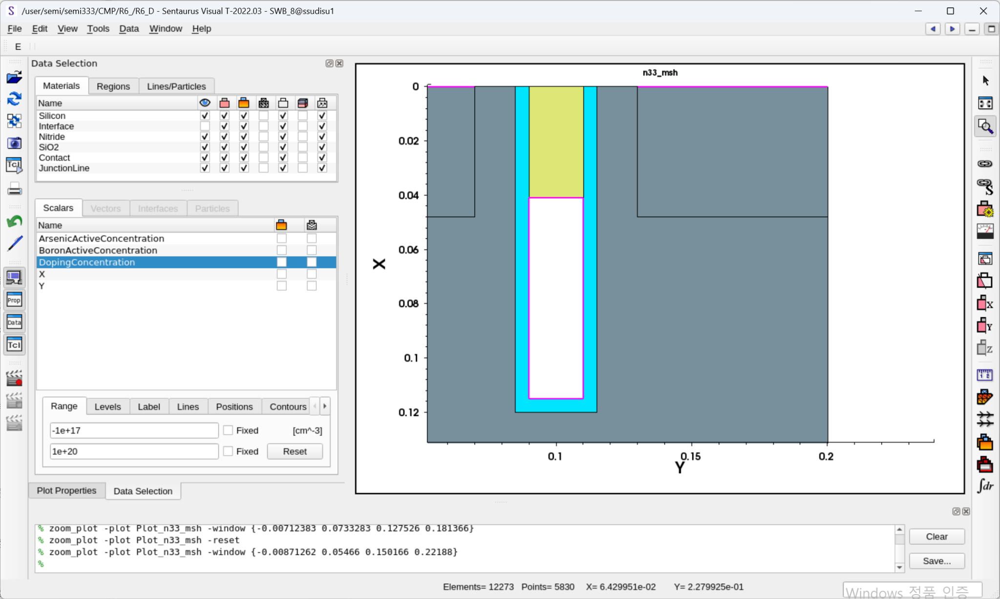 | 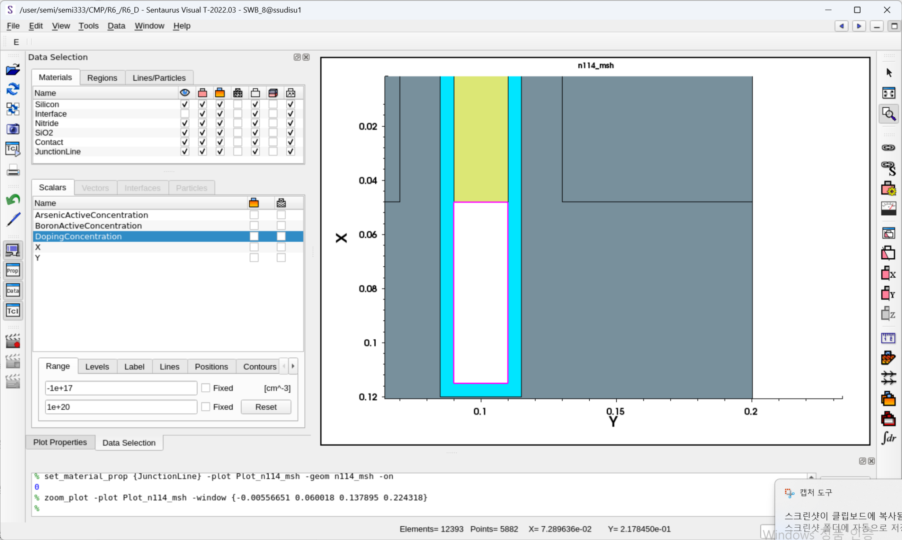 | 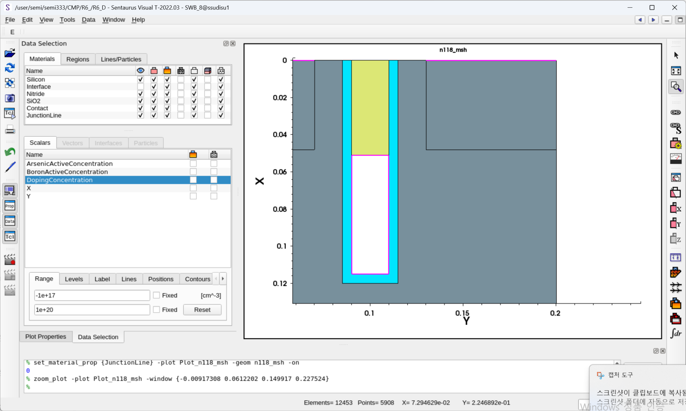 |

The 48 nm case is the model-internal `GateTop≈Jdepth` alignment point.
These images are structural evidence only; they do not by themselves establish an electrical optimum.

## 6. Extended 300 K GIDL

| MEB | GIDL ON endpoint |
|---:|---:|
| 36 nm | `1.3777737e-14 A` |
| 41 nm | `7.7683012e-15 A` |
| 43 nm | `5.6821e-15 A` |
| 45 nm | `3.9345e-15 A` |
| 47 nm | `2.0128e-15 A` |
| 48 nm | `1.9375e-15 A` |
| 49 nm | `1.8860e-15 A` |
| 51 nm | `3.2571e-16 A` |

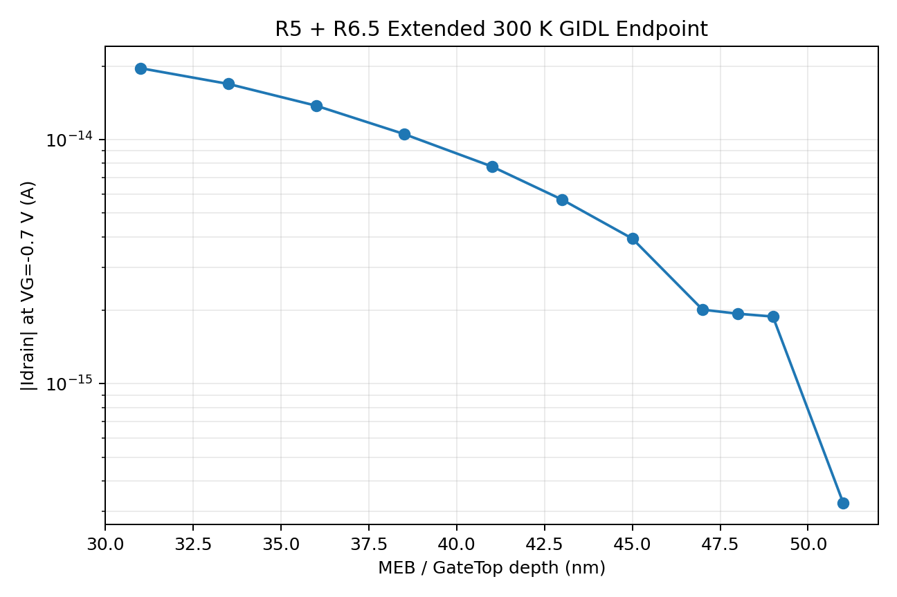

The stable endpoint trend shows a strong reduction from 41 to 47 nm, followed by only
small incremental changes from 47→48 (`~3.74%`) and
48→49 (`~2.66%`). The 51 nm endpoint is much lower,
but the terminal tail is low-current/background-sensitive and is not used as a
high-confidence optimum ranking point.

## 7. BTBT-OFF diagnostic

| MEB | ON @ 300 K | OFF @ 300 K | OFF / ON |
|---:|---:|---:|---:|
| 47 nm | `2.013e-15` | `2.956e-16` | `14.7%` |
| 48 nm | `1.938e-15` | `5.04e-17` | `2.6%` |
| 49 nm | `1.886e-15` | `5.75e-17` | `3.0%` |
| 51 nm | `3.257e-16` | `3.29e-17` | `10.1%` endpoint |

The OFF branch is a diagnostic reference under the frozen project physics. `ON−OFF` is
**not** promoted to calibrated pure-BTBT current.

The 47–49 nm ON endpoints remain clearly above the OFF reference. At 51 nm, the full
low-current tail becomes sufficiently sensitive to numerical/background behavior that the
endpoint alone is not a reliable design-selection criterion.

## 8. Extended Cgd

| MEB | `|c(g,d)|` |
|---:|---:|
| 36 nm | `1.6829628e-16` |
| 41 nm | `1.5230092e-16` |
| 43 nm | `1.4596929e-16` |
| 45 nm | `1.3975704e-16` |
| 47 nm | `1.3367808e-16` |
| 48 nm | `1.3065280e-16` |
| 49 nm | `1.2768057e-16` |
| 51 nm | `1.2192450e-16` |

`c(d,g)≈c(g,d)` remains numerically reciprocal.

**Key revision:** `Cgd` does **not** saturate at 48 nm. It decreases smoothly through
51 nm. Therefore `GateTop=Jdepth` is a geometry boundary, not a Cgd saturation boundary.

## 9. Extended fixed-wall field

| MEB | `E_wall,max` (V/cm) | peak X (um) |
|---:|---:|---:|
| 36 | 867936.60 | 0.038656 |
| 41 | 857194.93 | 0.042563 |
| 43 | 850925.62 | 0.044531 |
| 45 | 842971.43 | 0.046094 |
| 47 | 832607.27 | 0.047656 |
| 48 | 825733.44 | 0.048437 |
| 49 | 818162.50 | 0.049219 |
| 51 | 802740.97 | 0.050781 |

`E_wall,max` also decreases continuously through 51 nm, while the formal peak shifts
deeper with MEB. The 48 nm case is therefore **not** selected because field saturates.

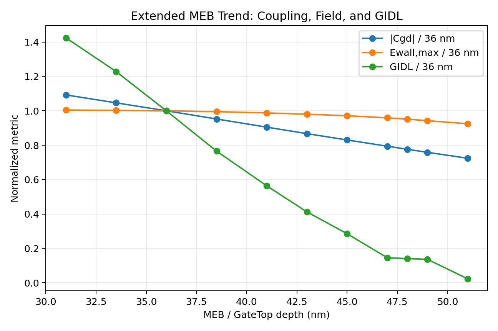

## 10. Updated interpretation of the Run 5 correlation

Run 5 remains valid inside its declared 31–41 nm window. Its five-point correlations were:

- Cgd–GIDL Pearson `0.999586`
- Cgd–Ewall Pearson `0.967757`
- Ewall–GIDL Pearson `0.965410`
- Spearman `1.0` for all three pairs

Across the full 31–51 nm endpoint set, the descriptive correlations remain monotonic but
the linear relationship weakens, especially for Ewall–GIDL:

| Pair | Pearson, 31–51 nm | Spearman |
|---|---:|---:|
| Cgd–GIDL | `0.991545` | `1.000000` |
| Cgd–Ewall | `0.943618` | `1.000000` |
| Ewall–GIDL | `0.894490` | `1.000000` |

Excluding the low-confidence 51 nm endpoint yields Ewall–GIDL Pearson
`0.911471`.

The scientific update is therefore:

> `Cgd` and the fixed-wall field remain useful electrostatic indicators, but neither is
> treated as a universal single linear predictor of terminal GIDL over an arbitrarily
> extended MEB range.

This does not invalidate Run 5; it narrows the interpretation to the range actually tested.

## 11. 300 K DC guardrail

| MEB | Vth low/high (V) | SS low/high (mV/dec) | Ion (A) | DIBL (mV/V) |
|---:|---:|---:|---:|---:|
| 48 | 0.932639 / 0.887755 | 106.868 / 107.034 | `4.13759e-6` | 47.247 |
| 49 | 0.932642 / 0.887741 | 106.890 / 107.057 | `4.13689e-6` | 47.264 |
| 51 | 0.932650 / 0.887711 | 106.947 / 107.140 | `4.13518e-6` | 47.304 |

The direction is slightly worse with deeper MEB (`Ion↓`, `SS↑`, `DIBL↑`), but no material
additional DC penalty is resolved under the present model/protocol.

## 12. 48/49 nm elevated-temperature extension

### 12.1 Total GIDL and OFF background

| MEB | T | ON | OFF | OFF fraction |
|---:|---:|---:|---:|---:|
| 48 | 340 K | `3.663e-15` | `9.033e-16` | `24.7%` |
| 48 | 380 K | `4.946e-14` | `4.526e-14` | `91.5%` |
| 49 | 340 K | `2.043e-15` | `6.610e-16` | `32.4%` |
| 49 | 380 K | `4.826e-14` | `4.548e-14` | `94.2%` |

Compared with historical P1=41 nm, the total endpoint reduction is approximately:

| T | 48 vs 41 | 49 vs 41 |
|---:|---:|---:|
| 300 K | `75.1%` | `75.7%` |
| 340 K | `68.1%` | `82.2%` |
| 380 K | `18.2%` | `20.2%` |

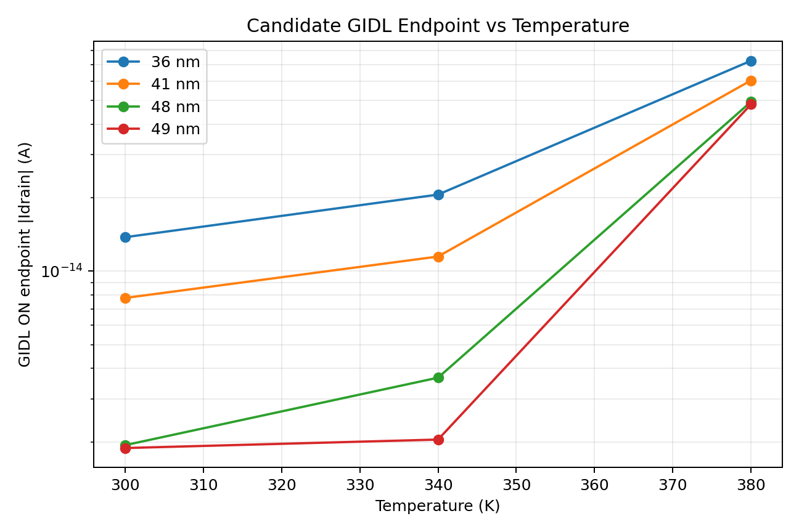

At 340 K, 49 nm has a substantially lower total endpoint than 48 nm. At 380 K, however,
the total difference is only about `2.43%`,
while both cases are dominated by the BTBT-OFF background reference.

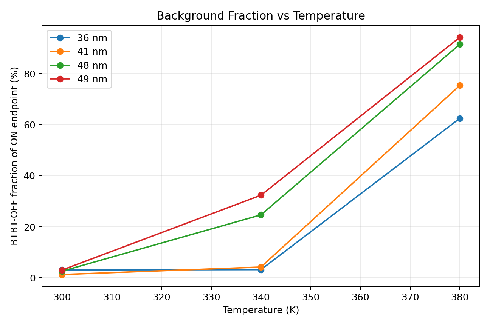

### 12.2 Thermal fixed-wall field

| MEB | 300 K | 340 K | 380 K |
|---:|---:|---:|---:|
| 48 | 825733.44 | 821954.41 | 817800.92 |
| 49 | 818162.50 | 814390.43 | 810245.57 |

The 300→380 K field change is only about 1%, and the peak X position remains fixed for
each geometry. The compressed 380 K total-current separation is therefore more consistent
with background leakage dominance than with collapse of the formal hotspot field.

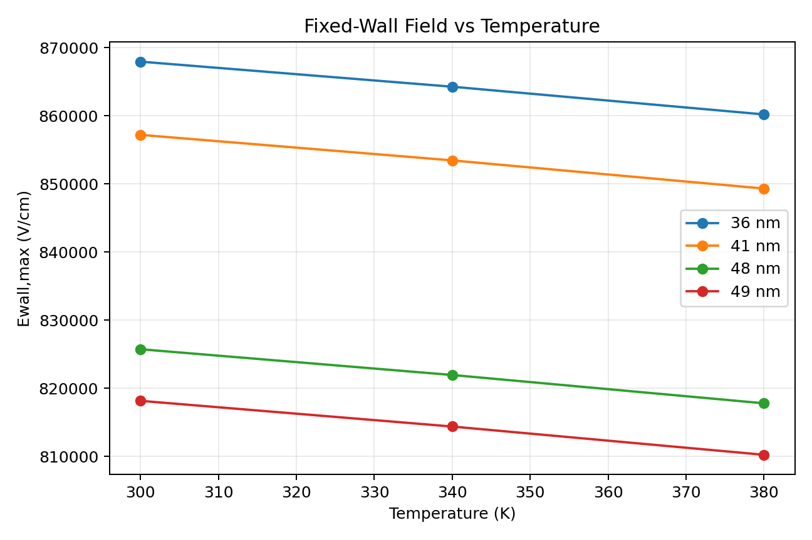

### 12.3 Thermal DC

48/49 nm show nearly identical thermal DC shifts. No material additional thermal DC
penalty distinguishing the two is resolved.

## 13. Spatial evidence

Curated SVisual evidence is committed under `assets/images/run06_5/`.

### 13.1 P2 structure and Mesh-GIDL

| P2 = 48 nm full geometry | P2 = 48 nm Mesh-GIDL hotspot |
|---|---|
| 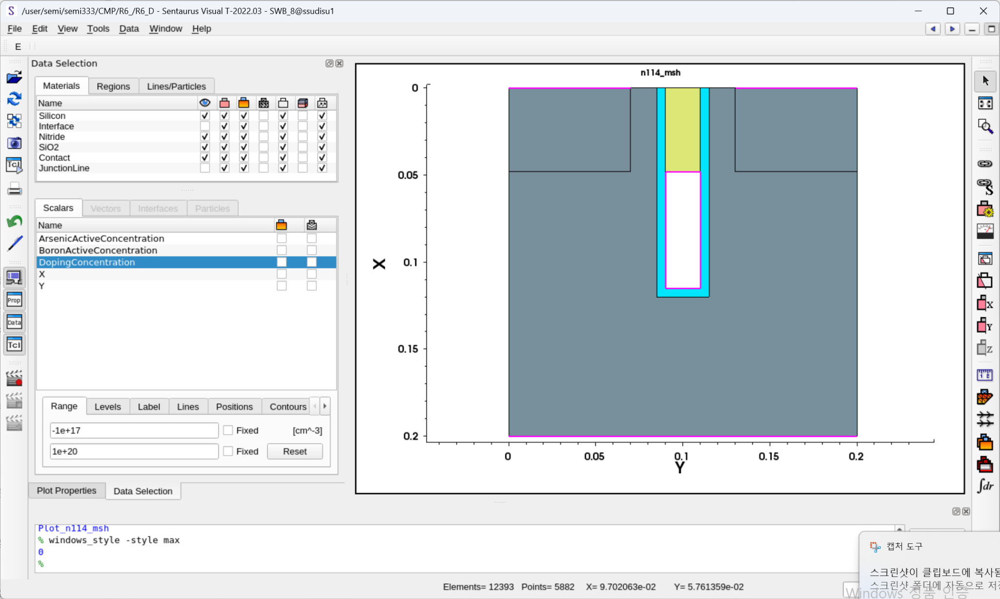 | 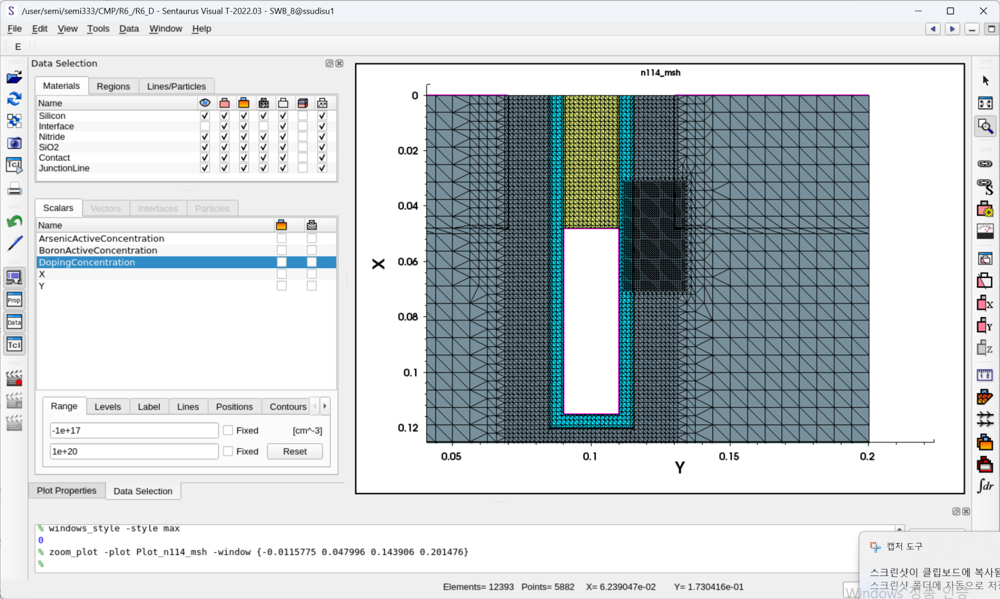 |

The mesh image shows that refinement is concentrated around the drain-side gate/junction region
rather than uniformly refining the full silicon body.

### 13.2 P2 ElectricField and Band2BandGeneration

| ElectricField hotspot | Band2BandGeneration hotspot |
|---|---|
| 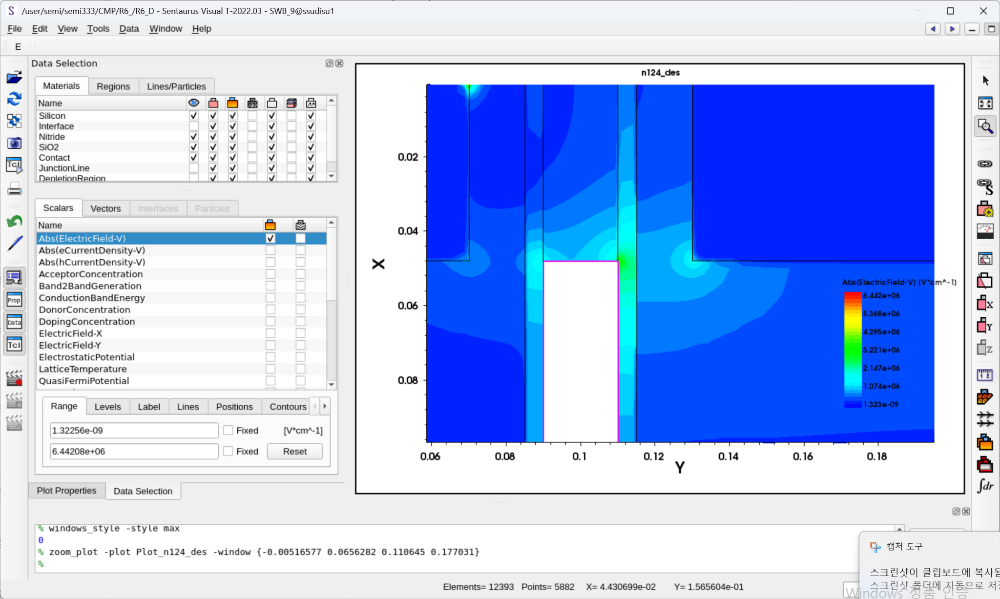 | 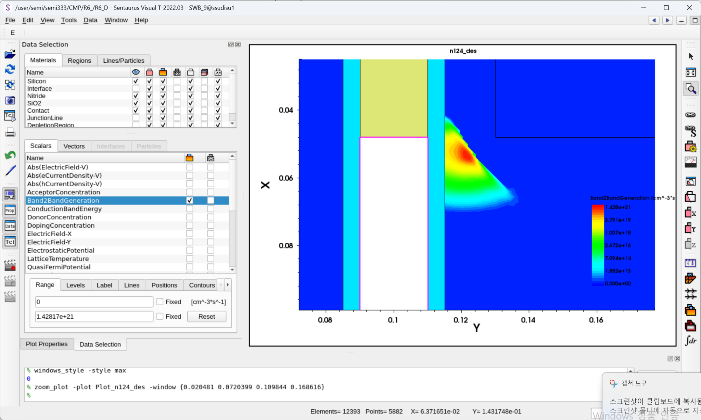 |

These images show that the relevant field/BTBT morphology remains localized near the
drain-side gate/junction region for P2 and remains inside the Mesh-GIDL refinement area.

The visual evidence therefore demonstrates:

- 41→48→51 nm geometry movement of GateTop;
- `GateTop≈Jdepth` at 48 nm in the simplified 2D structure;
- local Mesh-GIDL refinement around the drain-side hotspot;
- ElectricField hotspot morphology;
- localized Band2BandGeneration on the drain-side gate/junction region.

Automatic contour color scales differ between captures, so the screenshots are used for
**location/morphology evidence only**, not cross-case amplitude ranking.

## 14. Candidate comparison

| Criterion | 48 nm | 49 nm | 51 nm |
|---|---|---|---|
| 300 K GIDL | very low | `~2.66%` lower than 48 | much lower endpoint, low confidence |
| 340 K GIDL | low | strongly lower | not run as formal thermal candidate |
| 380 K total GIDL | background-dominated | `~2.43%` lower than 48 | not formal |
| Cgd | low | `~2.27%` lower | lowest tested |
| Ewall | low | `~0.92%` lower | lowest tested |
| DC guardrail | no material penalty | no material penalty | no material penalty |
| Structural meaning | **GateTop≈Jdepth boundary** | 1 nm beyond boundary | deeper than boundary |
| Numerical confidence | high | high | low for terminal ranking |
| Role | **P2** | challenger / sensitivity reference | floor-sensitive boundary reference |

## 15. Final R6.5 decision

### P1

`P1 = 41 nm` is preserved as the **historical initial screened-window candidate** selected
after Run 5 and carried through Run 6.

### P2

`P2 = 48 nm` is selected as the:

> **extended-MEB structural-boundary knee candidate for retention handoff**

The selection is **not** because 48 nm has the absolute minimum Cgd, field, or current.
Instead, it combines:

1. strong GIDL suppression relative to P1;
2. entry into the observed 47–49 nm stable endpoint plateau;
3. continued Cgd and fixed-wall field reduction;
4. clear ON/OFF separation at 300 K;
5. no resolved material DC or thermal-DC penalty;
6. an interpretable model-internal `GateTop≈Jdepth` boundary;
7. avoidance of using the low-confidence 51 nm floor-sensitive endpoint as an optimum.

### Why not 49 nm as P2?

49 nm is **not rejected as a bad design**. It is retained as the primary challenger because
it has slightly lower 300 K Cgd/Ewall/GIDL and a notably lower 340 K total endpoint.
However:

- the 300 K GIDL gain over 48 nm is only ~2.66%;
- the 380 K total-current gain is only ~2.43% and is background-dominated;
- its OFF fraction is higher than 48 nm at 340/380 K;
- it provides no clearly resolved DC advantage;
- it lies beyond the interpretable `GateTop=Jdepth` boundary without a separately modeled
  process/manufacturing benefit.

For the next single-candidate retention implementation, 48 nm is therefore the more
defensible **primary handoff point**, while 49 nm remains a sensitivity comparator.

### Why not 51 nm?

51 nm is excluded from optimum ranking because its terminal GIDL tail approaches a
low-current/background-sensitive regime. Its continued Cgd/Ewall reduction is real within
the internal metrics, but the isolated very-low terminal endpoint is not sufficiently
robust to justify a “best design” claim.

## 16. Claim boundary

R6.5 directly supports:

- monotonic Cgd reduction through 51 nm;
- monotonic formal Ewall reduction through 51 nm;
- deeper field-peak movement with MEB;
- stable terminal GIDL suppression through the 47–49 nm region;
- no material additional DC penalty for 48/49/51 under the present model;
- strong high-temperature background dominance at 380 K;
- P2=48 nm as an interpretable retention-handoff candidate.

R6.5 does **not** establish:

- a global or production optimum;
- physical MEB etch-process behavior;
- calibrated production-cell Cov/GIDL;
- pure BTBT from ON−OFF subtraction;
- direct retention-time improvement;
- refresh-burden reduction;
- 3D saddle-fin behavior;
- Dual-WF superiority;
- a process-variation robust window.

## 17. Handoff to Run 7

Run 7 should now define a defensible retention implementation:

```text
B0 = 36 nm
P1 = 41 nm historical reference
P2 = 48 nm primary extended-MEB candidate
49 nm = optional challenger/sensitivity check
```

Priority path:

1. map storage node and bit line;
2. define capacitor / MixedMode representation;
3. define write → hold → read;
4. choose `Q(t)` / `Vstorage(t)` / retention-time metric;
5. test B0 vs P1 vs P2;
6. use 49 nm only if one additional challenger point is affordable;
7. proceed to refresh translation only after a direct or clearly labeled retention metric exists.


## 18. Post-R6.5 Research Direction Note — 2026-08-27

The R6.5 decision itself is unchanged.

`P2=48 nm` remains the extended-MEB structural/electrostatic handoff candidate selected from the completed transistor-level study.
For the post-R6.5 mainline, its role is further specified as:

> **transistor-level electrostatic/GIDL candidate selected for cell-level retention validation**

No cell-level, global, production, or robust optimum is frozen at this stage.

Run 7+ will determine whether the transistor-level GIDL advantage translates into storage-node retention improvement and whether that translation changes as elevated-temperature background leakage becomes significant.
`49 nm` remains the primary challenger and may modify the final candidate interpretation if the cell-level evidence supports it.

The revised post-R6.5 mainline is:

```text
Run 7  1T1C / retention feasibility & metric freeze
Run 8  MEB-to-cell retention translation @ 300 K
Run 9  temperature-dependent retention translation
Run 9.5 alternate-leakage diagnostic, conditional
Run 10 local MEB sensitivity / optional robustness extension
```

Refresh and robust-window interpretations remain downstream/conditional and are not claimed from R6.5.
