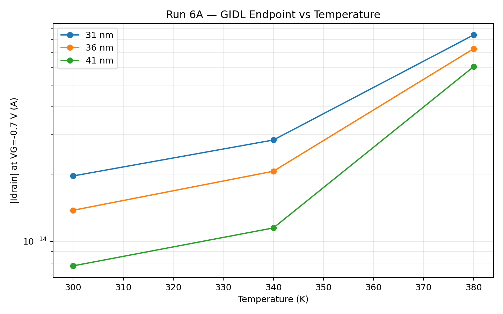
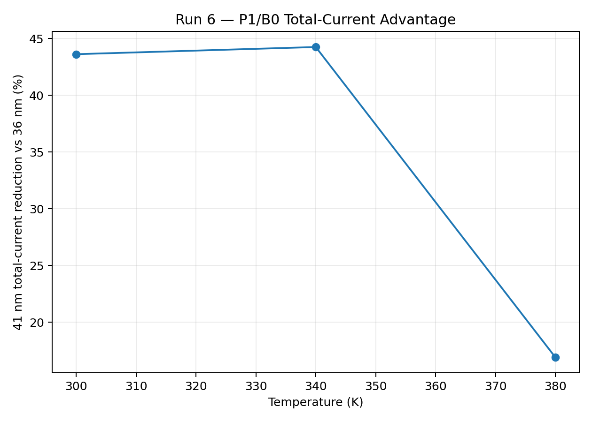
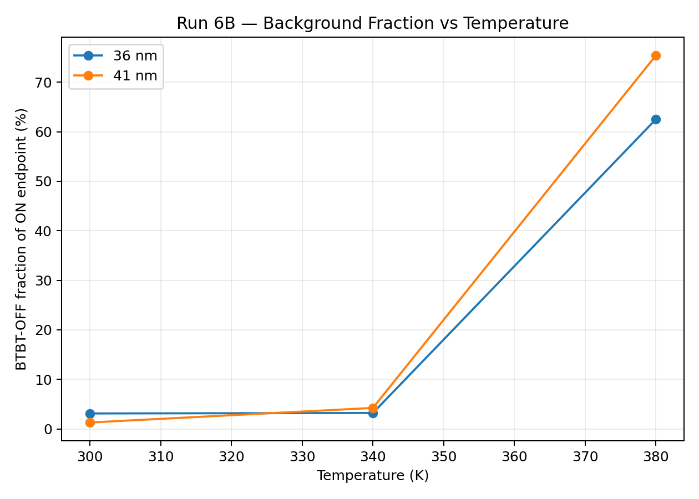
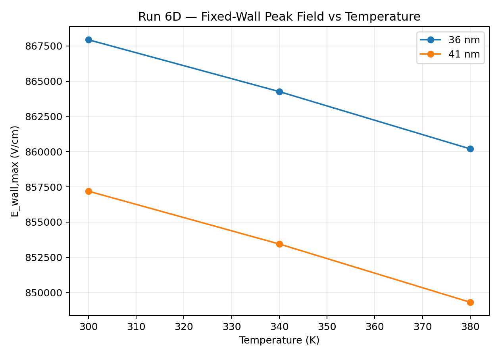

# Run 06 — Elevated-Temperature Robustness

## 1. Status

**Completed — PASS**

Run 6 evaluates whether the Run 5 MEB-dependent low-GIDL direction survives elevated
fixed-temperature operation. It is an **isothermal device comparison**, not an
electrothermal self-heating simulation.

No additional TCAD simulation is required for Run 6 scientific close-out.

## 2. Objective

Run 5 selected `P1 = 41 nm` as a provisional low-GIDL candidate inside the tested
31–41 nm window. Run 6 asks:

1. Does the `31 > 36 > 41 nm` GIDL ranking remain at 340/380 K?
2. Does the 41 nm total-current advantage survive temperature?
3. Does high-temperature BTBT-OFF background current change the leakage balance?
4. Does 41 nm introduce any additional DC thermal penalty relative to B0 = 36 nm?
5. Does the fixed drain-side field advantage survive temperature?

## 3. Temperature interpretation

Formal temperatures:

```text
300 / 340 / 380 K
```

These represent elevated fixed lattice-temperature conditions. Run 6 does **not**
simulate where heat is generated, heat flow, package thermal resistance, or self-heating.

## 4. R6A — GIDL ON temperature matrix

Frozen GIDL conditions:

```text
MEB = 31 / 36 / 41 nm
Mesh_Code = 3
VD = 1.2 V
VG = 0 -> -0.7 V
requested output = 5 mV
Band2Band(Model=NonlocalPath)
Temperature = @Temp_K@
metric = |Idrain| @ VG=-0.7 V
```

All nine raw curves contain 141 requested points and reach the formal endpoint.

| MEB | 300 K | 340 K | 380 K | 380/300 |
|---:|---:|---:|---:|---:|
| 31 nm | `1.9624468e-14` | `2.8417863e-14` | `8.3890071e-14` | `4.275` |
| 36 nm | `1.3777737e-14` | `2.0596211e-14` | `7.2793771e-14` | `5.283` |
| 41 nm | `7.7683012e-15` | `1.1482812e-14` | `6.0486855e-14` | `7.786` |

The 300 K values reproduce Run 5 exactly (`0%` endpoint error for 31/36/41 nm).

The ranking remains:

```text
31 nm > 36 nm > 41 nm
```

at all three temperatures.



### P1 total-current advantage

| Temperature | `I41 / I36` | 41 nm reduction vs 36 nm |
|---:|---:|---:|
| 300 K | `0.563830` | `43.62%` |
| 340 K | `0.557521` | `44.25%` |
| 380 K | `0.830934` | `16.91%` |

The total-current advantage is essentially retained through 340 K but becomes smaller at 380 K.

At 380 K the full ON curves also show a large current near `VG=0`, a minimum at
approximately:

- 31 nm: `VG≈-0.45 V`
- 36 nm: `VG≈-0.44 V`
- 41 nm: `VG≈-0.495 V`

followed by an increase toward `VG=-0.7 V`. This shape is interpreted only after the
BTBT-OFF control is included.



## 5. R6B — BTBT-OFF background control

R6B uses the same geometry, mesh, bias, and base physics as R6A with
`Band2Band(Model=NonlocalPath)` removed.

| MEB | T | ON `|Id|` | OFF `|Id|` | ON/OFF | OFF fraction |
|---:|---:|---:|---:|---:|---:|
| 36 | 300 | `1.3777737e-14` | `4.2880983e-16` | `32.13` | `3.11%` |
| 41 | 300 | `7.7683012e-15` | `1.0003367e-16` | `77.66` | `1.29%` |
| 36 | 340 | `2.0596211e-14` | `6.6050197e-16` | `31.18` | `3.21%` |
| 41 | 340 | `1.1482812e-14` | `4.8584734e-16` | `23.63` | `4.23%` |
| 36 | 380 | `7.2793771e-14` | `4.5487250e-14` | `1.60` | `62.49%` |
| 41 | 380 | `6.0486855e-14` | `4.5594188e-14` | `1.33` | `75.38%` |

At 300/340 K the BTBT-OFF endpoint is only a small fraction of the ON result.
At 380 K the OFF fraction rises to approximately:

- **62.5%** for 36 nm
- **75.4%** for 41 nm

This supports the interpretation that the total-current leakage balance changes strongly
at 380 K and that a large BTBT-OFF background contribution compresses the visible P1/B0
difference in the total endpoint.



### ON−OFF diagnostic limitation

The final audit found an important sign/provenance nuance:

- at 300 K the BTBT-OFF terminal-current endpoint has the opposite sign from the ON endpoint;
- at 340/380 K ON and OFF endpoint signs are consistent.

Therefore a single **signed** `ON−OFF` current ratio across 300/340/380 K is **not promoted
as a formal Run 6 metric**.

At 340/380 K, where signs are consistent, the 41/36 same-sign ON−OFF diagnostic ratios are:

- 340 K: `0.551621`
- 380 K: `0.545389`

These remain project-internal mechanism diagnostics and are **not calibrated pure-BTBT current**.

## 6. R6C — DC thermal guardrail

Run 6C adds 340/380 K results for B0=36 nm and P1=41 nm under the frozen formal DC protocol.

| MEB | T | Vth low/high (V) | SS low/high (mV/dec) | Ion (A) | DIBL (mV/V) |
|---:|---:|---:|---:|---:|---:|
| 36 | 300 | 0.932629 / 0.887843 | 106.817 / 106.975 | `4.1413410e-6` | 47.143 |
| 41 | 300 | 0.932631 / 0.887819 | 106.849 / 106.984 | `4.1404784e-6` | 47.170 |
| 36 | 340 | 0.813206 / 0.767181 | 126.030 / 127.771 | `7.3687816e-6` | 48.447 |
| 41 | 340 | 0.813209 / 0.767154 | 126.084 / 127.747 | `7.3668271e-6` | 48.479 |
| 36 | 380 | 0.693745 / 0.644068 | 163.857 / 165.713 | `1.1245560e-5` | 52.291 |
| 41 | 380 | 0.693749 / 0.644035 | 163.883 / 165.744 | `1.1241907e-5` | 52.331 |

Temperature materially changes the DC metrics, but 36 and 41 nm shift almost identically.
For example, the 41 nm Ion difference relative to 36 nm is only about:

- 300 K: `-0.0208%`
- 340 K: `-0.0265%`
- 380 K: `-0.0325%`

No additional material DC thermal penalty attributable to P1=41 nm is resolved.

The 380 K SS fits remain usable but have lower linearity (`R²≈0.9923`) than the 340 K
fits (`R²≈0.9995–0.9997`). This is recorded as a high-temperature extraction limitation,
not a rerun requirement.

## 7. R6D — Temperature-dependent fixed-wall field

Formal definition is unchanged from Run 5:

```text
quantity = Abs(ElectricField-V)
source = final R6A GIDL ON TDR
bias = VD=1.2 V, VG=-0.7 V
cut = Y=0.116 um
formal ROI = X=0.032–0.070 um
metric = E_wall,max
```

This is **not global Emax**.

| MEB | T | `E_wall,max` (V/cm) | Peak X (um) | Same-MEB / 300 K |
|---:|---:|---:|---:|---:|
| 36 | 300 | 867936.60 | 0.038656 | 1.000000 |
| 36 | 340 | 864258.25 | 0.038656 | 0.995762 |
| 36 | 380 | 860195.18 | 0.038656 | 0.991081 |
| 41 | 300 | 857194.93 | 0.042563 | 1.000000 |
| 41 | 340 | 853445.96 | 0.042563 | 0.995626 |
| 41 | 380 | 849313.54 | 0.042969 | 0.990806 |

The 300 K values reproduce Run 5 exactly. All peaks remain inside the formal ROI.

The fixed-wall field decreases slightly with temperature rather than showing a large
thermal increase. The 41 nm field remains about `1.24–1.27%` below the 36 nm value
across the full temperature set.



One 300 K / 41 nm field-cut export contains 250 rows rather than 251 because the far end
of the full cutline is missing. The formal ROI and peak are intact and reproduce the
Run 5 value exactly, so no re-export is required.

## 8. Integrated interpretation

### Verified

- Run 6A reproduces all 31/36/41 nm Run 5 GIDL endpoints exactly at 300 K.
- `31 > 36 > 41 nm` total-current ranking remains at 300/340/380 K.
- P1 total-current reduction vs B0 is about `43.6%`, `44.2%`, and `16.9%`.
- The BTBT-OFF fraction becomes much larger at 380 K.
- The fixed `E_wall,max` advantage of 41 nm remains nearly constant with temperature.
- B0 and P1 show nearly identical DC thermal shifts.

### Supported interpretation

The reduced total-current separation at 380 K is consistent with a growing BTBT-OFF
background contribution, rather than with collapse of the fixed-wall field advantage.
The MEB-dependent NonlocalPath-related suppression direction therefore remains supported,
while the total leakage balance changes at high temperature.

### Not verified

- electrothermal self-heating or heat transport;
- calibrated production-cell temperature-dependent leakage;
- a complete decomposition of every physical high-temperature leakage mechanism;
- calibrated pure BTBT current from ON−OFF subtraction;
- retention time or stored-charge decay;
- refresh-burden reduction;
- full 3D DRAM behavior;
- a global/final optimum beyond the tested MEB window.

## 9. Candidate decision

**P1 = 41 nm remains the provisional candidate entering Run 7 retention feasibility.**

Reason:

- lowest total GIDL among 31/36/41 nm at all tested temperatures;
- approximately 44% lower total endpoint than B0 through 340 K;
- still approximately 17% lower at 380 K despite strong background-current growth;
- stable fixed-wall field advantage;
- no resolved additional DC thermal penalty.

This is not a final/global/production optimum.

## 10. Run 6 exit

**PASS.**

Run 6 requires no additional TCAD simulation for scientific close-out.

Optional studies such as `Cgd(T)`, intermediate MEB points, or additional temperature
points are not required for the present Run 6 claim.

## 11. Handoff to Run 7

Run 7 must determine whether the transistor-level leakage advantage can be translated into
a defensible retention metric.

The next gate should define:

- storage-node / bit-line mapping;
- capacitor or explicit retention-proxy representation;
- write / hold / read sequence;
- charge-loss or retention-time metric;
- pass/fail criterion;
- whether direct 1T1C MixedMode is feasible or a clearly labeled proxy is necessary.

Run 6 does **not** itself claim retention or refresh improvement.

## R6.5 follow-up note — 2026-08-23

Run 6 remains the formal 31/36/41 nm elevated-temperature robustness record.
R6.5 was added afterward to close the unresolved 41 nm search-boundary question.

The extended study selected **P2=48 nm** as the primary retention-handoff candidate while
preserving **P1=41 nm** as the historical initial screened-window candidate.
**49 nm** is retained as the primary challenger/sensitivity point.

The Run 6 high-temperature conclusion is not invalidated:
380 K total-current separation remains strongly influenced by BTBT-OFF background current.
R6.5 observed the same background-dominance issue for 48/49 nm.

Run 7 should therefore use B0=36 nm, P1=41 nm, and P2=48 nm as the primary retention set,
with 49 nm included only as an optional sensitivity comparator.
